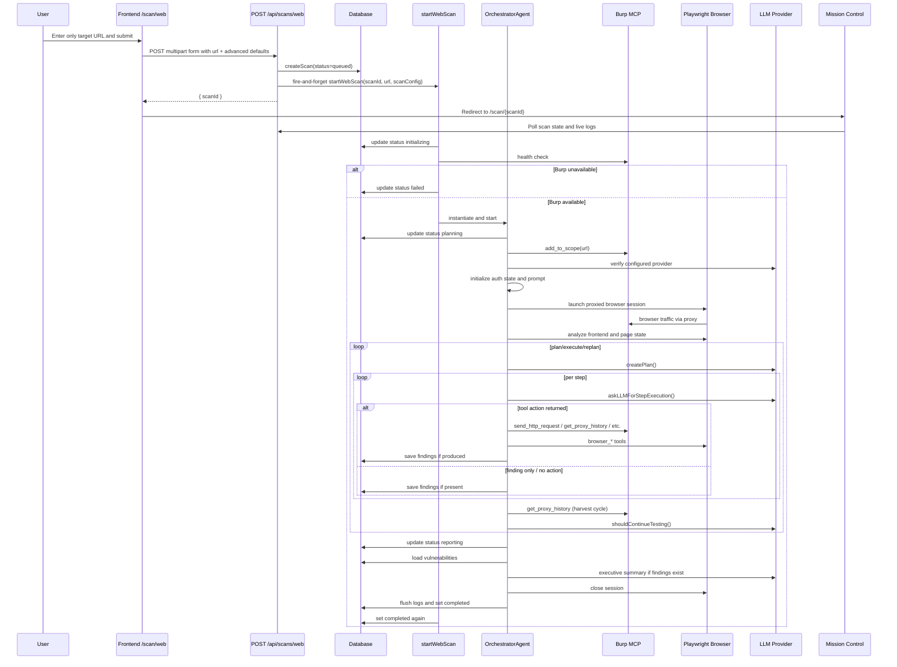
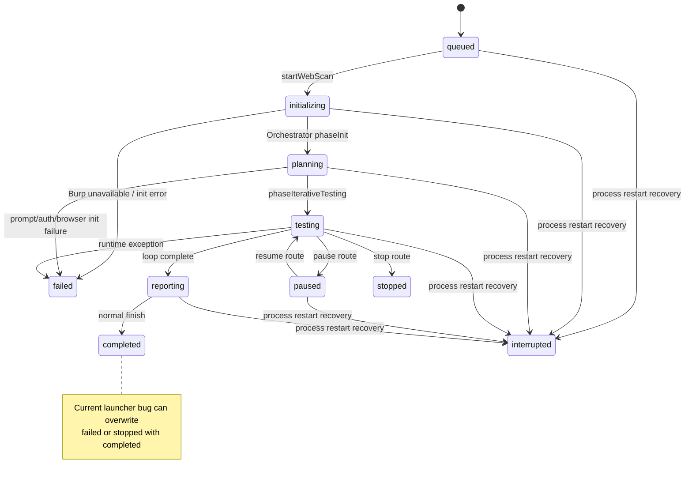

# PenPard Web Application Scan Runtime Audit

## 1. Audit Goal
This audit reconstructs how PenPard executes a Web Application Scan when the operator starts the scan from the UI with only a single target URL and no additional operator instructions, credentials, imported request, or hidden startup context. The goal is to describe the real runtime path, data flow, state changes, tool calls, persistence points, and failure behavior from UI submission through scan completion or failure.

## 2. Input Assumption
The audited input is a single target URL, for example:

`http://localhost:9000`

Assumptions enforced by this audit:

- No extra scan instructions are provided.
- No session cookies are manually pasted.
- No IDOR user list is supplied.
- No request is imported from Burp.
- No source package is uploaded or linked.
- No custom startup prompt exists beyond whatever PenPard itself loads from its configured prompt sources.

## 3. High-Level Execution Summary
The default Web Application Scan starts in the frontend scan form at [`/Users/tcegerede/Desktop/penpard/frontend/src/app/scan/web/page.tsx`](/Users/tcegerede/Desktop/penpard/frontend/src/app/scan/web/page.tsx). When the user submits only a URL, the page sends a multipart `POST` request to `POST /api/scans/web` on the backend, still including several advanced scan knobs from frontend state and local storage defaults. The backend route at [`/Users/tcegerede/Desktop/penpard/backend/src/routes/scans.ts`](/Users/tcegerede/Desktop/penpard/backend/src/routes/scans.ts) authenticates the user, validates the URL, creates a `scans` row with initial `queued` state, constructs an in-memory scan configuration object, and starts the actual scan asynchronously via `startWebScan(...)`.

The runtime scan is executed by `OrchestratorAgent` in the single-agent default path. Before active testing begins, the agent checks Burp MCP availability, adds the target to Burp scope, checks whether an LLM provider is configured, loads prompt material, initializes authentication state, optionally launches a Playwright browser through Burp proxy, extracts browser intelligence, and seeds the system prompt. It then enters a plan/execute/replan loop driven by LLM responses. Step execution dispatches tool calls to Burp MCP tools, browser tools, and PenPard’s traffic harvest / hypothesis / coverage helpers. Findings can be created from LLM output, from limited automatic response analysis, or from repeater-based hypothesis validation. Logs are buffered in memory and periodically flushed to the database and log files.

At the end of a normal run, the agent generates a summary in the reporting phase, updates the scan status, persists remaining logs, and closes the browser session. Important caveat: several runtime mismatches and status-handling bugs mean the actual behavior is weaker and less reliable than the intended design. In particular, Burp result parsing mismatches can cripple traffic harvesting and auth capture, and the launcher can overwrite failed or stopped scans back to `completed`.

## 4. Exact Runtime Entry Path
The default UI entry path for a Web Application Scan is:

1. Dashboard card in [`/Users/tcegerede/Desktop/penpard/frontend/src/app/dashboard/page.tsx`](/Users/tcegerede/Desktop/penpard/frontend/src/app/dashboard/page.tsx) links to `/scan/web`.
2. The actual scan form page is [`/Users/tcegerede/Desktop/penpard/frontend/src/app/scan/web/page.tsx`](/Users/tcegerede/Desktop/penpard/frontend/src/app/scan/web/page.tsx).
3. Submitting the form calls `handleStartScan`.
4. `handleStartScan` builds a `FormData` payload and sends:
   - Method: `POST`
   - URL: `${API_URL}/scans/web`
   - `API_URL` comes from [`/Users/tcegerede/Desktop/penpard/frontend/src/lib/api-config.ts`](/Users/tcegerede/Desktop/penpard/frontend/src/lib/api-config.ts) and defaults to `http://localhost:4000/api`.
   - Auth: `Authorization: Bearer <JWT>`
   - Content type: browser-generated multipart form data
5. Backend route receiver:
   - Express mounts scan routes at `/api/scans` in [`/Users/tcegerede/Desktop/penpard/backend/src/index.ts`](/Users/tcegerede/Desktop/penpard/backend/src/index.ts)
   - Request lands at `POST /web` inside [`/Users/tcegerede/Desktop/penpard/backend/src/routes/scans.ts`](/Users/tcegerede/Desktop/penpard/backend/src/routes/scans.ts)
6. Immediate runtime service entrypoint:
   - Route creates DB scan row via `createScan(...)` in [`/Users/tcegerede/Desktop/penpard/backend/src/db/init.ts`](/Users/tcegerede/Desktop/penpard/backend/src/db/init.ts)
   - Route starts the actual background scan with `startWebScan(scanId, targetUrl, scanConfig)`
   - Single-agent default path inside `startWebScan` instantiates `new OrchestratorAgent(...)`
   - Execution begins with `await agent.start()`

## 5. End-to-End Control Flow
1. User navigates to `/scan/web`.
2. Frontend initializes scan form state, including advanced options from local storage key `penpard-scan-options`.
3. User enters only a target URL.
4. `handleStartScan` normalizes the URL by prepending `https://` if the field does not start with `http://` or `https://`.
5. Frontend appends the following form fields even in the URL-only case:
   - `url`
   - `rateLimit`
   - `parallelAgents`
   - `iterations`
   - `maxPlanRounds`
   - `useNuclei`
   - `useFfuf`
   - `idorUsers` as `"[]"`
6. Frontend does not append `scanInstructions` unless non-empty.
7. Frontend does not append `sessionCookies` unless non-empty.
8. Frontend does not append source-analysis fields unless a source package is selected.
9. Frontend sends `POST /api/scans/web`.
10. Backend authenticates the JWT using `authenticateToken`.
11. Backend parses and validates request fields in `POST /web`.
12. Backend parses `idorUsers` if provided as a string.
13. Backend validates the target with `new URL(targetUrl)`.
14. Backend checks whitelist restrictions via `isWhitelisted(targetUrl)`.
15. Backend forcibly disables `useNuclei` and `useFfuf` even if the frontend sent `true`, because the route marks those integrations unimplemented.
16. Backend optionally processes source input if source mode was requested. In the URL-only path this branch is skipped.
17. Backend creates a `scans` row with status `queued`.
18. Backend builds a transient in-memory `scanConfig` object from the request.
19. Backend logs API usage to `backend/logs/api-usage.log`.
20. Backend starts `startWebScan(...)` without awaiting it.
21. Backend immediately returns JSON containing `scanId`.
22. Frontend receives the response and redirects the browser to `/scan/<scanId>`.
23. Mission Control page starts polling:
   - `GET /api/scans/:id` for persisted scan state and findings
   - `GET /api/scans/:id/live?since=N` for live logs and active-agent state
24. `startWebScan` updates scan status to `initializing`.
25. `startWebScan` checks whether Burp MCP is available by creating `BurpMCPClient` and calling `.isAvailable()`.
26. If Burp MCP is unavailable, the scan is marked `failed` and execution stops.
27. If Burp MCP is available, `startWebScan` decides between:
   - Single-agent `OrchestratorAgent`
   - Multi-agent `AgentPool`
28. If explicit authentication was requested or detected and `parallelAgents > 1`, the launcher forces single-agent mode to avoid splitting live auth state across workers.
29. URL-only default path is still typically single-agent because frontend default `parallelAgents` is `1` unless local storage overrides it.
30. `OrchestratorAgent` is stored in the `activeAgents` map.
31. `agent.start()` begins.
32. `OrchestratorAgent.start()` updates scan status to `initializing`.
33. `phaseInit()` runs.
34. `phaseInit()` checks Burp availability again and calls `add_to_scope`.
35. `phaseInit()` checks whether an LLM configuration exists.
36. `phaseInit()` loads PenPard “mindset TTPs”.
37. `phaseInit()` initializes authentication state from manual cookies, IDOR identities, and initial request data.
38. `phaseInit()` loads the system prompt template.
39. `phaseInit()` appends auth context and optional source/initial-request context to the system prompt.
40. `phaseInit()` stores that system prompt as the first `conversationHistory` message.
41. `phaseInit()` launches a Playwright browser session if possible.
42. `phaseInit()` performs initial frontend analysis and Burp correlation from the browser session.
43. `phaseInit()` appends browser-derived intelligence back into `conversationHistory[0]`.
44. URL-only path skips operator-instruction analysis because no `customSystemPrompt` exists.
45. URL-only path skips initial-request replay seeding because no `initialRequest` exists.
46. `phaseIterativeTesting()` begins and updates scan status to `testing`.
47. The agent enters a loop bounded by:
   - `isRunning`
   - `maxPlanRounds` if non-zero
   - `totalActions < maxIterations`
48. At each round, the agent handles pause state if needed.
49. At each round, the agent processes one queued human command if present.
50. Agent calls `createPlan()` with current conversation state and contextual summaries.
51. `createPlan()` uses the LLM to generate a plan with steps.
52. The agent executes each plan step in sequence.
53. For each step, the agent can perform up to 5 LLM-driven action turns.
54. Each action turn calls the LLM with an execution prompt.
55. If the LLM returns a `finding` or `findings`, the agent persists them immediately.
56. If the LLM returns an `action`, the agent dispatches it through `executeToolCall(...)`.
57. Tool execution can call Burp MCP, browser helpers, or PenPard v2 helpers such as `harvest_traffic`, `get_hypotheses`, `get_coverage`, and `repeater_test`.
58. Results from tool execution are summarized back into `conversationHistory`.
59. After all plan steps in the round, the agent runs `runHarvestCycle()`.
60. `runHarvestCycle()` tries to pull new Burp proxy traffic, promote interesting requests, generate hypotheses, and append a harvest summary to the conversation.
61. Agent runs `deltaFrontendAnalysis('round-end')` to detect new browser-side routes and artifacts.
62. Agent calls `shouldContinueTesting(...)`.
63. If the replan response says the engagement is complete, the loop stops.
64. Otherwise the next round begins.
65. When the loop ends, `phaseReporting()` starts and updates scan status to `reporting`.
66. Agent loads vulnerabilities from the database.
67. If findings exist, the agent asks the LLM for an executive summary and logs it.
68. Agent marks its internal phase `completed`.
69. Agent updates scan status to `completed`.
70. Agent closes the browser session.
71. Agent saves logs to file and database.
72. `startWebScan` removes the agent from `activeAgents`, caches recent logs in `scanLogCache`, flushes logs, disconnects Burp, and then also updates scan status to `completed`.
73. Mission Control polling eventually observes the persisted terminal state and final findings.

## 6. Initialization Phase Breakdown
The initialization sequence in the default single-agent path is implemented primarily in `OrchestratorAgent.phaseInit()` at [`/Users/tcegerede/Desktop/penpard/backend/src/agents/OrchestratorAgent.ts`](/Users/tcegerede/Desktop/penpard/backend/src/agents/OrchestratorAgent.ts). The confirmed order is:

1. Set agent `phase = 'planning'`.
2. Persist scan status as `planning`.
3. Log that the scan is initializing.
4. Call `burp.isAvailable()` and fail hard if Burp MCP is not reachable.
5. Call Burp MCP tool `add_to_scope` with `{ url: this.targetUrl }`.
6. Check whether an LLM provider is configured with `checkLLM()`. This does not send a model request; it checks for an active provider/config.
7. Load mindset TTPs via `mindsetService.getRelevantTTPs(this.targetUrl)`.
8. If a source package was supplied, analyze it and cache source-analysis JSON into the `scans` row. URL-only path skips this.
9. Initialize auth state via `authManager.initialize({ sessionCookies, idorUsers, initialRequest }, burp, browserSessionId)`.
10. Build an auth prompt block via `authManager.getSystemPromptBlock()`.
11. Load the active prompt template using `loadPromptTemplate()`.
12. Combine prompt template plus:
    - auth block
    - optional source-analysis block
    - optional initial-request block
13. Store the assembled system prompt in `this.systemPromptContent`.
14. Push the system prompt as the first `conversationHistory` message.
15. Call `initBrowserAndAnalyze()`.
16. If `customSystemPrompt` exists, analyze operator instructions with the LLM and inject focused-scope guidance. URL-only path skips this.
17. If `initialRequest` exists, derive and inject request-replay guidance. URL-only path skips this.

Important initialization facts for the URL-only case:

- Burp scope is always attempted before active testing.
- Authentication initialization still runs, but with almost no direct input beyond the target URL and any previously observed Burp traffic.
- Browser analysis is attempted by default even with no extra instructions.
- The prompt is never “URL only” in the literal sense. It always contains PenPard’s base system prompt plus whatever auth/browser context PenPard is able to synthesize.

## 7. Prompt / LLM Construction Path
The system prompt path is implemented in `OrchestratorAgent.loadPromptTemplate()` and `phaseInit()` in [`/Users/tcegerede/Desktop/penpard/backend/src/agents/OrchestratorAgent.ts`](/Users/tcegerede/Desktop/penpard/backend/src/agents/OrchestratorAgent.ts), with prompt templates in [`/Users/tcegerede/Desktop/penpard/backend/src/prompts/orchestratorPrompts.ts`](/Users/tcegerede/Desktop/penpard/backend/src/prompts/orchestratorPrompts.ts).

Confirmed prompt construction order:

1. Try Prompt Library active template via `PromptLibraryService.getActivePromptTemplate()`.
2. If none, try legacy settings row `settings.key = 'prompts'`.
3. If none, fall back to `DEFAULT_WEB_PROMPT`.
4. If `customSystemPrompt` exists, prepend an operator-instructions wrapper above the base prompt.
5. Append auth prompt block from `AuthStateManager`.
6. Append source-analysis context if present.
7. Append initial-request context if present.
8. Save full result as `systemPromptContent`.
9. Store it as the first system message in `conversationHistory`.

For the URL-only scan, the prompt path behaves as follows:

- `customSystemPrompt` is absent, so no operator text is prepended.
- No operator-instruction analysis runs.
- No focused-scope constraints are derived from human instructions, so the focused-scope tool blocker in `executeToolCall()` never activates.
- No imported request context is appended.
- Source context is absent.
- Auth block is still appended and usually contains only the default primary identity plus a note that no auth material has been captured yet, unless cookies or tokens were discovered from Burp/browser state.
- Browser intelligence may later mutate `conversationHistory[0]` by appending a “BROWSER ANALYSIS INTELLIGENCE” block after browser launch.

LLM interaction points in the default runtime:

- `createPlan()` uses `PLAN_PROMPT`.
- `askLLMForStepExecution()` uses `EXECUTE_STEP_PROMPT`.
- `shouldContinueTesting()` uses `REPLAN_PROMPT`.
- `phaseReporting()` may ask for an executive summary.
- `analyzeOperatorInstructions()` only runs when manual instructions exist, so not in the URL-only path.

All LLM calls are serialized through `llmQueue` in [`/Users/tcegerede/Desktop/penpard/backend/src/services/llmQueue.ts`](/Users/tcegerede/Desktop/penpard/backend/src/services/llmQueue.ts):

- Maximum concurrent calls: 1
- Minimum inter-request delay: 2000 ms
- Timeout: 30000 ms
- Retries: one retry for rate-limit, timeout, or connection-reset style failures

Important execution nuance:

- `shouldContinueTesting()` acts mainly as a continue/stop gate. Even if the LLM proposes a specific next plan there, the code does not directly consume that next plan. The next round still calls `createPlan()` again from scratch.

## 8. Browser-Assisted Analysis Path
Browser runtime is implemented in [`/Users/tcegerede/Desktop/penpard/backend/src/services/BrowserService.ts`](/Users/tcegerede/Desktop/penpard/backend/src/services/BrowserService.ts) and orchestrated by `OrchestratorAgent.initBrowserAndAnalyze()`.

Confirmed browser launch path:

1. `initBrowserAndAnalyze()` logs that browser analysis is starting.
2. It calls `browserService.launchSession(1, { targetUrl, scanId, headless: true })`.
3. `BrowserService.launchSession(...)` creates a DB row in `browser_sessions`.
4. It launches Playwright Chromium using `launchPersistentContext(...)`.
5. Chromium is configured to use Burp as proxy.
6. HTTPS errors are ignored so the browser can traverse Burp TLS interception.
7. A persistent profile directory is created under `~/.penpard/browser_sessions/<sessionId>`.
8. The initial page is opened and navigated to the target URL.
9. Browser session DB state is updated to `active`.
10. Orchestrator stores `browserSessionId`.
11. Orchestrator seeds cookies into the browser from auth state if any exist.
12. Orchestrator synchronizes cookies/storage back from the browser into auth state.
13. Orchestrator calls `browserService.analyzeFrontend(sessionId)`.
14. Orchestrator calls `browserService.getPageState(sessionId)`.
15. Orchestrator calls `browserService.correlateBrowserWithBurp(sessionId, targetUrl, burp)`.
16. Orchestrator appends browser-derived intelligence to the system prompt in memory.

What browser analysis extracts:

- API-looking endpoints from inline script text
- GraphQL indicators
- WebSocket URLs
- Token-like patterns
- CSRF token candidates
- Frontend routes
- Hidden parameters
- Current page forms, links, scripts, cookies, localStorage, sessionStorage, and metadata via page-state extraction

What browser analysis does not fully do:

- It does not deeply ingest and parse the contents of external bundled JavaScript files in the normal analysis path.
- Screenshot data is not persisted to the database or file storage in this scan path even though browser tooling can capture it.

When browser analysis runs:

- It runs during initialization before iterative testing starts.
- It can also run incrementally during the scan through browser tools and `deltaFrontendAnalysis('round-end')`.

Failure behavior:

- Browser launch/analysis failure is non-fatal.
- If Playwright/browser analysis fails, the agent logs a warning and continues in HTTP/Burp-only mode.

Important confirmed runtime defect:

- `launchSession` is called with hardcoded `userId = 1`, so `browser_sessions.user_id` is misattributed for scans run by other users.

## 9. Burp / MCP Interaction Path
Burp integration spans:

- Backend client: [`/Users/tcegerede/Desktop/penpard/backend/src/services/burpMCP.ts`](/Users/tcegerede/Desktop/penpard/backend/src/services/burpMCP.ts)
- Burp extension/MCP server: [`/Users/tcegerede/Desktop/penpard/burp-mcp-extension/src/main/kotlin/com/penpard/mcp/ToolRegistry.kt`](/Users/tcegerede/Desktop/penpard/burp-mcp-extension/src/main/kotlin/com/penpard/mcp/ToolRegistry.kt) plus related server/tool classes

Confirmed Burp runtime path:

1. Backend constructs `BurpMCPClient`.
2. Availability is checked via Burp MCP `/health`.
3. Tool calls are sent as JSON-RPC over HTTP to Burp’s `/message` endpoint.
4. During initialization, PenPard calls `add_to_scope`.
5. During testing, PenPard may call Burp tools directly from LLM actions or indirectly through helper methods.
6. `send_http_request` routes traffic through Burp proxy when `use_proxy: true`.
7. Burp tags PenPard requests using `X-PenPard-Agent`, highlights them in history, and strips the header before forwarding.
8. Proxy history, cookies, sitemap, and scanner hooks are accessible through MCP tools.

Burp tools exposed by the extension that materially matter to the scan:

- `add_to_scope`
- `get_scope`
- `get_proxy_history`
- `get_session_cookies`
- `get_cookies_and_auth_for_host`
- `get_sitemap`
- `send_http_request`
- `spider_url`
- `extract_links`
- `generate_payloads`
- `check_authorization`
- `send_to_scanner`
- `send_to_repeater`
- `get_scanner_issues` exists in the extension but is not wired into the orchestrator’s normal action dispatch

Whether Burp scope is set:

- Yes. In the normal single-agent startup path, `phaseInit()` explicitly calls `add_to_scope` with the target URL before active testing.

What `spider_url` really does:

- Confirmed from the Kotlin implementation: it effectively adds the target to scope and reports readiness for crawling.
- It does not implement a full active crawl/spider from inside the extension.

How traffic is supposed to be harvested:

1. Agent sends requests through Burp proxy using `send_http_request`.
2. Browser traffic also goes through Burp because Chromium is proxied through Burp.
3. PenPard later asks Burp for proxy history.
4. PenPard parses new history items into `HarvestedRequest` objects.
5. PenPard promotes interesting requests for hypothesis generation.

Important confirmed response-shape mismatches:

- Burp MCP returns tool results wrapped as `content[0].text` JSON strings.
- Several PenPard consumers do not parse that wrapper correctly.
- `RequestHarvester` expects `history` or `entries`, but Burp returns `items`.
- `AuthCapture.fromBurpHistory()` does not parse the MCP wrapper shape at all.
- `BrowserService.correlateBrowserWithBurp()` expects `history`, not `items`.
- `executeSendHttpRequest()` treats response fields like `statusCode` and `body` as top-level fields instead of parsing the MCP wrapper.

Practical consequence:

- Burp is required for the scan to start, but several of the intended “observe and harvest from Burp” mechanics are likely partially inert in the current implementation.

## 10. Iterative Testing Loop
The default iterative loop is implemented in `OrchestratorAgent.phaseIterativeTesting()`.

Confirmed loop structure:

1. Update scan status to `testing`.
2. Initialize `totalActions = 0`.
3. While:
   - `isRunning` is true
   - current plan round is below `maxPlanRounds`, unless `maxPlanRounds === 0`
   - `totalActions < maxIterations`
4. If paused, sleep in a loop until resumed or stopped.
5. If a human command is queued, process one command before planning.
6. Increment `planRound`.
7. Call `createPlan()`.
8. Iterate through returned `steps`.
9. For each step, allow up to 5 LLM action turns.
10. Each action turn:
    - calls `askLLMForStepExecution(step, recentResults)`
    - increments action counters
    - persists any finding payload returned by the LLM
    - if the LLM included an `action`, dispatches it
    - if no action is returned, the step ends
11. After all steps, call `runHarvestCycle()`.
12. Call `deltaFrontendAnalysis('round-end')`.
13. Call `shouldContinueTesting(roundResults)`.
14. Stop if the LLM says the engagement is complete.
15. Otherwise continue to the next round.

How step execution works:

- The LLM returns JSON-like action directives.
- `executeToolCall()` is the central dispatcher.
- Tool results are logged and fed back into conversation context.
- The orchestrator stores `stepResults`, `requestHistory`, `lastRequestResponse`, `discoveredEndpoints`, and other transient state as the run progresses.
- In runs where operator instructions produce `focusedScopePaths`, `executeToolCall()` blocks broad recon actions such as `spider_url`, `get_sitemap`, and `extract_links` outside that focused scope. In the URL-only path this blocker is inactive.
- `executeSendHttpRequest()` also contains execution guards for duplicate-request suppression, SQLMap-style multi-`NULL` payload suppression, and temporary self-pausing after detected `429` responses.

How request/response pairs are analyzed:

- `send_http_request` stores request/response context in `lastRequestResponse`.
- `analyzeResponseForVulns()` performs limited automatic checks after requests, mainly reflected XSS and SQL error signatures.
- `repeater_test` compares mutated responses against original harvested responses using `ResponseDiffer`.
- LLM can also independently turn tool results into findings.

How hypotheses are created and evolved:

1. `runHarvestCycle()` asks `RequestHarvester` for new Burp traffic.
2. Promising requests are scored and promoted.
3. `HypothesisEngine.generateFromRequest(...)` creates hypotheses such as IDOR, reflected XSS, SQLi, CSRF bypass, auth bypass, mass assignment, GraphQL overreach, and info disclosure.
4. Hypotheses can be moved to `testing`.
5. `repeater_test` can update them toward `escalated`, `confirmed`, or `discarded`.

What decides continuation vs stop:

- Loop ends if:
  - `isRunning` becomes false
  - `maxIterations` budget is exhausted
  - `maxPlanRounds` limit is reached
  - `shouldContinueTesting(...)` decides the scan is complete
- `maxIterations` is effectively an LLM-action budget, not a raw HTTP-request count.

Important confirmed runtime limits:

- Single-agent `rateLimit` from the UI is not enforced as an outbound request throttle in this path.
- The dedicated `testedParameters` map exists in the orchestrator state but is not meaningfully used in the observed runtime path.

## 11. Tool Dispatch Matrix
| Tool / Service | Where Invoked | Condition | Input | Output | Downstream Effect |
| --- | --- | --- | --- | --- | --- |
| `add_to_scope` | `phaseInit()` | Always before active testing if Burp is up | `{ url }` | MCP wrapper with success text | Target is placed into Burp scope |
| `send_http_request` | `executeToolCall()` via LLM action | LLM chooses direct HTTP testing | Method, URL, headers, body, identity hints | Intended HTTP response details, but current code misreads wrapper | Updates `lastRequestResponse`, request history, endpoint discovery, possible vuln auto-analysis |
| `get_proxy_history` | `runHarvestCycle()`, auth capture helpers, Burp correlation, evidence lookup | After requests / browser traffic / explicit auth lookup | Time filters, details flags | MCP wrapper around `{ items, count, totalHistory }` | Intended to populate harvested traffic, auth state, browser correlation; current parsing mismatches reduce effectiveness |
| `get_session_cookies` | direct tool dispatch | LLM requests cookies for current URL | `{ url }` | MCP wrapper around cookie summary | Can feed auth context if parsed by caller |
| `get_cookies_and_auth_for_host` | direct tool dispatch | LLM requests known auth material | `{ host }` style args | MCP wrapper around host auth entries | Intended to expose cookies/tokens captured in Burp |
| `get_sitemap` | direct tool dispatch | LLM wants Burp site map unless focused-scope block forbids | `{ target }` | MCP wrapper with URLs | Intended endpoint discovery |
| `spider_url` | direct tool dispatch | LLM wants crawl/spider unless focused-scope block forbids | `{ url }` | Success wrapper | In practice only adds scope/readiness; no real spider |
| `extract_links` | direct tool dispatch | LLM wants link extraction unless focused-scope block forbids | Prompt expects `{ url }`; extension actually expects `{ html }` | Extracted links if input shape matches | Intended endpoint discovery; prompt/tool mismatch risks misuse |
| `check_authorization` | direct tool dispatch | LLM wants multi-session auth comparison | Prompt args differ from extension args | Result depends on correct arg shape | Intended authz testing; mismatch can break direct use |
| `generate_payloads` | direct tool dispatch | LLM requests payload generation | Payload class/context | Small canned payload list | Feeds next test steps |
| `send_to_scanner` | direct tool dispatch and `saveFinding()` side-effect to Repeater-like paths | LLM explicitly asks, or findings are sent to Burp tooling | Request details | Scanner/audit kickoff | No normal orchestrator polling path to harvest scanner issues |
| `browser_navigate` | `executeToolCall()` | LLM chooses browser navigation | URL / wait hints | Navigation result | Updates browser state, coverage, and possibly frontend workflow mapping |
| `browser_get_page_state` | `executeToolCall()` | LLM wants DOM/page details | Session context | Forms, links, hidden inputs, cookies, storage | Feeds plan context and auth awareness |
| `browser_get_frontend_analysis` | `executeToolCall()` and init | Browser session available | Session ID | Frontend-discovered endpoints and indicators | Adds discovered endpoints and context |
| `browser_fill_and_submit` | `executeToolCall()` | LLM wants to submit UI forms | Selectors and values | Submission/navigation result | May create authenticated context, route discovery, and auth-state sync |
| `browser_evaluate_js` | `executeToolCall()` | LLM needs custom DOM/JS introspection | Script | JS execution result | Can refine hypotheses or endpoint discovery |
| `browser_screenshot` | `executeToolCall()` | LLM wants visual evidence | Page/session | Capture metadata | Returns note only; binary screenshot is not persisted in this scan path |
| `browser_correlate_burp` | `executeToolCall()` and init | Browser session available | Session + target context | Correlation result | Intended to align frontend-discovered endpoints with Burp-observed traffic |
| `harvest_traffic` | `executeToolCall()` or `runHarvestCycle()` internals | Explicit LLM request or end-of-round harvest | Burp history context | New harvested requests | Seeds coverage and hypothesis generation |
| `get_hypotheses` | `executeToolCall()` | LLM asks for current hypothesis inventory | None / filters | Current hypotheses | Guides focused validation |
| `get_coverage` | `executeToolCall()` | LLM asks for coverage state | None | Coverage summary | Guides planning and stop decisions |
| `repeater_test` | `executeToolCall()` | LLM validates a hypothesis by mutating a request | Hypothesis/request mutation recipe | Diff result and possible confirmation | Can mark coverage, update hypothesis status, and save findings |
| `PromptLibraryService` | `loadPromptTemplate()` | Every scan init | Active prompt settings | Template string | Defines system prompt base |
| `AuthStateManager` | init and request prep | Every scan init and authenticated request path | Cookies, identities, initial request, browser sync | Auth identities, headers, prompt block | Shapes auth testing and request construction |
| `RequestHarvester` | `runHarvestCycle()` | End of each plan round | Burp history | Harvested requests | Intended to feed hypotheses and coverage |
| `HypothesisEngine` | `runHarvestCycle()`, `repeater_test` | When promoted traffic exists | Requests and diffs | Hypothesis objects | Drives deeper validation |
| `CoverageTracker` | browser tools, harvest cycle, repeater tests | Throughout scan | Routes, test classes, workflows | Coverage summary/state | Helps planning and stop decisions |
| `LLMProviderService` | all LLM calls | LLM configured | Prompt messages and model config | Model response | Drives plan creation, execution, replan, and summary |

## 12. State Model
### Persistent DB state
| State Bucket | Storage | Confirmed Fields / Behavior | Notes |
| --- | --- | --- | --- |
| Scan record | `scans` table | `id`, `user_id`, `type`, `target`, `status`, `error_message`, timestamps, optional `source_package_path`, `source_analysis_mode`, `source_analysis_result_json`, `initial_request_*` | URL-only creation persists only a subset of runtime config; advanced knobs are mostly not stored |
| Findings | `vulnerabilities` table | Name, type, severity, description, path, parameter, request/response evidence, CWE/CVSS fields, screenshot path, scan id | Created incrementally during the run |
| Scan logs | `scan_logs` table | Log rows persisted periodically and at end | Live logs are also buffered in memory |
| Chat messages | `chat_messages` table | Only operator/assistant chat from Mission Control command route | Internal orchestrator conversation is not persisted here |
| Browser sessions | `browser_sessions` table | Session metadata, status, mode, scan id, user id | `user_id` is hardcoded to `1` in agent-launched sessions |
| Browser actions | `browser_actions` table | Recorded browser/system/human actions | Persists browser activity metadata |
| Token usage | `llm_token_usage` | Provider/model usage rows | Current orchestrator calls do not consistently attach scan-specific context |
| Reports | `reports` table | Generated export artifacts | Not automatically populated by the normal scan completion path |

### Transient in-memory state
| State Bucket | Owner | Contents | Lifetime |
| --- | --- | --- | --- |
| Active scan objects | `activeAgents`, `activeAgentPools` maps in `routes/scans.ts` | Live `OrchestratorAgent` or `AgentPool` objects | Process lifetime only |
| Recent finished logs | `scanLogCache` | Recent completed scan logs for UI fallback | Process lifetime only, capped cache |
| Conversation history | `OrchestratorAgent` | System prompt plus ongoing plan/tool/result messages | Lost on restart |
| Findings buffer | `OrchestratorAgent.findings` | In-memory finding list | DB is source of truth for persisted findings |
| Request history | `OrchestratorAgent.requestHistory` | Requests sent during current run | Lost on restart |
| Last request/response | `OrchestratorAgent.lastRequestResponse` | Evidence for the most recent meaningful request | Lost on restart |
| Discovered endpoints | `OrchestratorAgent.discoveredEndpoints` | Set of routes/endpoints seen in browser/tooling | Lost on restart |
| Step results | `OrchestratorAgent.stepResults` | LLM/tool summaries from current session | Lost on restart |
| Auth state | `AuthStateManager` | Identities, cookies, auth headers, heuristics | Lost on restart except whatever is separately stored in browser profile/Burp |
| Harvested traffic | `RequestHarvester` | Parsed Burp history items | Lost on restart |
| Hypotheses | `HypothesisEngine` | Generated/updated hypotheses | Lost on restart |
| Coverage | `CoverageTracker` | Route/workflow/test coverage | Lost on restart |
| Live browser objects | `BrowserService` | Playwright browser contexts/pages | Lost if process exits |

### Scan lifecycle state
| State | Where Set | Meaning |
| --- | --- | --- |
| `queued` | `createScan(...)` | Scan row created, execution not started yet |
| `initializing` | `startWebScan()`, `OrchestratorAgent.start()` | Launcher/agent bootstrap in progress |
| `planning` | `phaseInit()` | Prompt/auth/browser/bootstrap work in progress |
| `testing` | `phaseIterativeTesting()` and resume route | Iterative plan/execute loop active |
| `paused` | pause route | Scan is paused in memory; loop waits |
| `reporting` | `phaseReporting()` | Final summarization phase |
| `completed` | `phaseReporting()`, also `startWebScan()` wrapper | Normal terminal state, but can also overwrite failed/stopped states |
| `failed` | init/runtime exceptions | Terminal failure state |
| `stopped` | stop route | User-requested terminal stop |
| `interrupted` | startup orphan recovery | Previous non-terminal scans marked interrupted after process restart |

### Browser/session state
| State | Storage / Owner | Meaning |
| --- | --- | --- |
| `launching` | `browser_sessions.status` | Session row created, browser launching |
| `active` | `browser_sessions.status` | Browser running |
| `paused` | `browser_sessions.status` | Used by browser-level pause paths |
| `closed` | `browser_sessions.status` | Browser closed/cleaned up |
| `human` / `ai` / `mixed` | `browser_sessions.mode` | Session interaction mode |
| Persistent profile dir | filesystem under `~/.penpard/browser_sessions/<id>` | Cookies/storage/profile state survives browser close unless manually deleted |

### Hypothesis/coverage state
| State Bucket | Owner | Confirmed Behavior |
| --- | --- | --- |
| Hypothesis status | `HypothesisEngine` | `new`, `testing`, `escalated`, `confirmed`, `discarded` |
| Route coverage | `CoverageTracker` | Tracks discovered routes, frontend-only routes, Burp-observed routes, browser-exercised routes |
| Vulnerability-class coverage | `CoverageTracker` | Marked primarily by `repeater_test`, not by ordinary `send_http_request` flows |
| Workflow coverage | `CoverageTracker` | Inferred from route patterns and browser navigation |

## 13. Data Flow
### URL
1. User types URL in frontend form.
2. Frontend normalizes scheme if missing.
3. URL is sent as multipart field `url`.
4. Backend validates it with `new URL(...)`.
5. URL is persisted to `scans.target`.
6. URL becomes `targetUrl` in the live scan object.
7. URL is passed to:
   - Burp `add_to_scope`
   - browser launch and navigation
   - system prompt content
   - request planning and direct HTTP requests

### Scan config
1. Frontend state contributes rate limit, iterations, parallel agent count, max plan rounds, and optional booleans.
2. Backend builds transient `scanConfig`.
3. `scanConfig` is passed into `startWebScan`.
4. `scanConfig` is used to configure `OrchestratorAgent` or `AgentPool`.
5. Most of this config is not persisted to the `scans` table in the URL-only path.

### Prompt content
1. Base prompt is loaded from Prompt Library / settings / built-in default.
2. Auth context is appended.
3. Optional source and initial request context are appended if present.
4. Browser intelligence may later be appended into the system prompt.
5. `conversationHistory` carries prompt plus subsequent tool/result context across the live run.
6. Internal conversation history is not durably persisted.

### Cookies / auth material
1. Manual session cookies can arrive from the frontend, but not in the URL-only case.
2. IDOR users can arrive from the frontend, but not in the URL-only case.
3. Initial request headers can seed auth material, but not in the URL-only case.
4. Auth manager tries to supplement auth context from Burp/browser state.
5. Browser cookies and storage are synchronized into auth state after launch.
6. Auth material can be used to construct subsequent requests under different identities.
7. Most auth state is transient and process-local.

### Discovered endpoints
1. Browser analysis extracts routes/endpoints from page content.
2. Direct requests add URL paths into `discoveredEndpoints`.
3. Burp sitemap/proxy-history harvesting is intended to add more endpoints.
4. `deltaFrontendAnalysis` adds endpoints discovered from later browser states.
5. Coverage tracker is partially updated from browser and harvest events.

### Requests and responses
1. LLM step output chooses an HTTP or browser action.
2. `send_http_request` prepares headers/body and sends via Burp proxy.
3. Burp forwards traffic and stores proxy history.
4. Orchestrator stores a request/response summary in memory.
5. Repeater testing uses harvested request/response baselines plus mutations.
6. Evidence is used when persisting findings.

### Findings
1. Findings may originate from:
   - direct LLM `finding` payloads
   - automatic response analysis
   - repeater-confirmed hypotheses
2. `saveFinding()` deduplicates against existing DB rows.
3. `addVulnerability(...)` writes the finding to the `vulnerabilities` table.
4. Mission Control reads findings through `GET /api/scans/:id`.

### Logs
1. `OrchestratorAgent.log(...)` appends structured strings to an in-memory array.
2. Incremental flush writes to `scan_logs`.
3. Final save writes a log file and flushes remaining DB rows.
4. Live logs are served from active agent memory, then from `scanLogCache` or DB after completion.

## 14. Finding Creation Path
The confirmed main finding save path is `OrchestratorAgent.saveFinding(...)`.

Ways a vulnerability becomes a saved finding:

1. LLM-declared finding:
   - `askLLMForStepExecution()` returns `finding` or `findings`
   - orchestrator immediately calls `saveFinding(...)`

2. Automatic response heuristic:
   - after `send_http_request`, `analyzeResponseForVulns()` looks for simple indicators such as reflected payloads or SQL error signatures
   - if matched, it calls `saveFinding(...)`
   - current effectiveness is reduced because the response wrapper is not always parsed correctly

3. Hypothesis confirmation:
   - `repeater_test` mutates a harvested request
   - `ResponseDiffer` evaluates the response delta
   - if confidence crosses thresholds and the hypothesis is confirmed, `saveFinding(...)` is called

What `saveFinding(...)` does:

1. Normalize or synthesize a useful finding name if the proposed name is generic.
2. Attempt coarse deduplication against existing findings for the same scan/path/type combination.
3. If the finding is treated as a duplicate, skip insertion.
4. Reconstruct request and response evidence from `lastRequestResponse` or fallback data.
5. Insert the record into `vulnerabilities`.
6. Optionally send the request to Burp tooling for analyst follow-up.

Confirmed finding fields include:

- `name`
- `type`
- `severity`
- `description`
- `path`
- `parameter`
- `payload`
- `evidence`
- `request`
- `response`
- `reproduction_steps`
- `impact`
- `recommendation`
- `cwe_id`
- `cvss_score`

Important runtime constraints:

- Deduplication is heuristic, not exact. Duplicate-finding risk remains.
- Evidence quality depends heavily on whether raw request/response capture succeeded.
- Browser screenshot evidence is not normally persisted through this path.

## 15. Logging and Persistence Path
Logging and persistence span multiple layers.

### What is persisted during the scan
- `scans` row status transitions
- vulnerability rows
- periodic `scan_logs`
- browser session/action metadata
- optional source-analysis JSON if source mode is used

### What is persisted at the end
- final scan status
- `completed_at` for `completed` or `failed`
- remaining logs flushed to DB
- a filesystem log file for the scan

### Exact end-of-scan artifacts in the normal URL-only path
- one `scans` row with terminal status and timestamps
- zero or more `vulnerabilities` rows tied to the scan
- zero or more `scan_logs` rows
- one per-scan log file under `backend/logs/`
- zero or more `browser_sessions` and `browser_actions` rows if browser launch succeeded
- possible Burp-side scope, proxy-history, scanner, or repeater artifacts
- no automatic exported report artifact unless the separate reports route is called later

### Log flow
1. Orchestrator logs to in-memory `logs[]`.
2. Winston logger also writes to:
   - `backend/logs/combined.log`
   - `backend/logs/error.log`
3. API route logs to `backend/logs/api-usage.log`.
4. `flushLogsToDB()` periodically writes new logs into `scan_logs`.
5. `saveLogs()` writes `backend/logs/<scanId>.log` and flushes remaining DB log rows.

### What is not durably persisted
- internal LLM conversation history
- auth-manager runtime state
- harvested requests
- hypotheses
- coverage state
- transient browser page objects
- selected frontend `targetEndpoints` input
- most live scan config knobs used to launch the run

Important confirmed persistence gaps:

- The `scans` row created by the URL-only route does not store the effective `rateLimit`, `parallelAgents`, `iterations`, `maxPlanRounds`, `sessionCookies`, or `customSystemPrompt` used for that specific run.
- Stop/pause reason text is not consistently persisted because `updateScanStatus(...)` only stores `error_message` for `completed` and `failed`.

## 16. Failure Paths and Fallbacks
### Burp unavailable
- `startWebScan()` fails the scan immediately if Burp MCP is unavailable.
- Error message says the Burp MCP extension must be running on port `9876`.
- No degraded no-Burp mode exists for this route.

### Browser unavailable
- Browser launch/analysis failure is logged.
- Scan continues without browser assistance.

### LLM unavailable
- If no active LLM config exists, initialization throws and the scan fails.
- There is no non-LLM fallback for the orchestrator path.

### Source analysis unavailable
- URL-only path does not use source analysis.
- If source mode were requested and failed, that would affect context enrichment, not the pure URL path.

### Mid-run exception
- `OrchestratorAgent.start()` catches errors, logs them, updates status to `failed`, and then returns without rethrowing.
- `startWebScan()` then continues to its normal post-run cleanup and unconditionally sets scan status to `completed`.
- Confirmed risk: a failed run can end up persisted as `completed`.

### User stop
- `/api/scans/:id/stop` stops the active agent/pool, flushes logs, removes it from active maps, and sets status to `stopped`.
- Confirmed risk: the outer `startWebScan()` wrapper may still later write `completed`, overwriting the stop state.

### Pause/resume
- Pause sets `isPaused` and scan status `paused`.
- Resume clears pause and sets status `testing`.
- The advertised `ActivityMonitorService` is effectively disabled because `ASSIST_ENABLED = false`; pause messaging implies more protection than actually exists.

### Lost-state conditions
- Process restart triggers `recoverOrphanedScans()`, which marks in-progress scans as `interrupted`.
- Live in-memory state is lost:
  - conversation history
  - auth state
  - request history
  - hypotheses
  - coverage
  - active browser context

### Silent or weak fallbacks
- Browser failure silently degrades to non-browser mode.
- Several Burp data-processing paths silently produce empty results because of wrapper-shape mismatches.
- `useNuclei` and `useFfuf` are silently forced off by the backend.

### Cleanup behavior
- Browser contexts are closed in normal cleanup.
- Burp client disconnects.
- Active agent maps are cleaned.
- Persistent browser profile directories are not removed, so session directories can accumulate.

## 17. What Happens Specifically When Only a URL Is Given
This is the default audited case.

Confirmed behavior when only a URL is provided:

1. Frontend still sends advanced scan parameters from current UI state and local storage defaults.
2. `scanInstructions` is absent, so no operator-specified testing scope, priorities, or constraints are injected.
3. `sessionCookies` is absent, so no manual authenticated context is seeded.
4. `idorUsers` is sent as an empty JSON array.
5. No imported request exists, so there is no exact request replay baseline.
6. No source package is analyzed.
7. Backend creates the scan and starts the orchestrator.
8. Burp availability is mandatory.
9. Burp scope is set using only the target URL.
10. Auth initialization still runs, but starts with minimal explicit auth material.
11. Browser analysis still launches by default and visits the target URL if Playwright works.
12. Browser-derived routes, forms, cookies, tokens, and storage may become the first meaningful context beyond the URL itself.
13. Planning begins from PenPard’s default prompt template or any globally active prompt-library template, not from custom operator text.
14. The first plan is therefore guided by PenPard’s generic methodology plus any auth/browser context it discovered during init.
15. Active testing then depends mostly on:
    - LLM-generated step plans
    - direct `send_http_request` calls
    - browser actions if the LLM chooses them
    - whatever Burp traffic can be harvested

Behavioral consequences of having only a URL:

- There is no focused-scope override, so the LLM is free to pursue broad reconnaissance within the target.
- There is no guaranteed authenticated testing context unless:
  - the browser naturally reaches a login or already-authenticated page state
  - Burp already contains reusable cookies/auth headers for the host
  - the LLM uses browser form automation to log in somehow without supplied credentials
- There is no imported request to anchor testing against a known sensitive endpoint.
- There is no backend use of frontend-selected `targetEndpoints`, so even if the user selected suggested endpoints in the UI, that selection does not constrain this runtime path.
- The scan relies more heavily on discovery and heuristic exploration.
- Because several Burp wrapper parsers are mismatched, the intended harvest-driven loop may produce much less signal than designed.
- The runtime may therefore lean disproportionately on LLM-led direct requests plus browser navigation rather than the richer “observe, harvest, hypothesize, validate” cycle the codebase appears to intend.

Important hidden assumptions in the URL-only path:

- A working Burp MCP extension must exist locally.
- An active LLM configuration must exist.
- A usable Chromium/Playwright environment must exist if browser analysis is expected.
- Local storage may carry prior advanced-option values, so “only a URL” does not guarantee default execution parameters.
- A globally active Prompt Library template may alter behavior even though the operator supplied no custom instructions.

## 18. Confirmed Facts vs Inferences
| Confirmed from source | Reasonable inference |
| --- | --- |
| Frontend start path is `/scan/web` and submission happens in `handleStartScan`. | If the user previously changed advanced options, local storage may materially change the scan even though only a URL was entered this time. |
| Backend receiver is `POST /api/scans/web`. | The typical first plan for a URL-only scan will emphasize reconnaissance and endpoint discovery because the default prompt strongly biases that behavior. |
| `createScan(...)` initially writes a `queued` scan row. | In many real runs, browser intelligence may provide the majority of early endpoint discovery if Burp harvesting remains impaired. |
| `startWebScan(...)` runs asynchronously and returns to the frontend immediately. | If Burp already has valid session cookies for the host, the scan may achieve partially authenticated coverage without the operator explicitly supplying cookies. |
| Burp availability is mandatory for starting the scan. | The “URL-only” scan may behave differently across installations because Prompt Library state and stored options are global/environmental inputs. |
| Single-agent default path instantiates `OrchestratorAgent`. | The agent is intended to simulate an analyst workflow, but actual runtime behavior is constrained by tool-wrapper mismatches and prompt/tool contract drift. |
| Initialization sets Burp scope and attempts browser analysis before iterative testing. | Many scans with no initial request and no explicit auth will remain largely reconnaissance-heavy rather than deeply exploit-validated. |
| `customSystemPrompt` analysis is skipped when no instructions are provided. | The stop/failed-to-completed overwrite bug likely causes user-visible confusion in Mission Control about whether a run really succeeded. |
| `runHarvestCycle()` executes after each plan round. | Because history parsing expects `history`/`entries` while Burp returns `items`, harvest-driven features are likely largely dormant unless other code paths compensate. |
| `saveFinding(...)` writes to `vulnerabilities` and dedupes heuristically. | Persisted findings may contain weaker evidence if raw request/response capture failed due to wrapper parsing issues. |
| Browser sessions are stored in DB and launched through Burp proxy. | The accumulating persistent browser profile directories can create long-term disk growth and auth residue risk. |
| `startWebScan()` unconditionally writes `completed` after `agent.start()` resolves. | Failed or stopped runs can be misreported as completed in production usage. |

## 19. Critical Runtime Risks
1. Failed or stopped scans can be overwritten to `completed` because `OrchestratorAgent.start()` swallows exceptions and `startWebScan()` always sets `completed` afterward.
2. Burp MCP wrapper/result-shape mismatches likely cripple traffic harvesting, auth capture from history, browser/Burp correlation, and some response analysis.
3. Prompt/tool contract drift is significant:
   - `spider_url` implies crawling but only sets scope
   - `extract_links` prompt args differ from tool args
   - `check_authorization` prompt args differ from tool args
   - `generate_payloads` capability is narrower than described
4. Single-agent `rateLimit` from the UI is not enforced as a real request throttle.
5. `targetEndpoints` selected in the frontend are not consumed by the backend route, so operator-selected endpoint constraints are ignored.
6. Browser session rows are written with hardcoded `user_id = 1`, causing ownership/accountability errors.
7. Persistent browser profile directories are not cleaned up, creating orphan session and disk-residue risk.
8. Most live operational state is in memory only; restart causes major state loss and orphan recovery merely marks scans `interrupted`.
9. Automatic auth capture from Burp history appears unreliable because parser expectations do not match the current Burp MCP response envelope.
10. Findings dedupe is heuristic and can still allow duplicates or near-duplicates.
11. Screenshot tooling does not persist useful screenshot evidence through the normal finding path.
12. Pause-mode messaging overstates protection because `ActivityMonitorService` is effectively disabled.
13. Token usage accounting exists but current LLM calls are not cleanly tied back to scan-level context.

## 20. Final Lifecycle Summary
The default URL-only Web Application Scan starts in the `/scan/web` frontend form, sends a multipart `POST /api/scans/web`, creates a `queued` scan row, and asynchronously launches `startWebScan`. The launcher verifies Burp MCP, chooses the single-agent path by default, and runs `OrchestratorAgent`. The agent initializes Burp scope, checks LLM configuration, initializes auth state, assembles the system prompt, launches a Burp-proxied Playwright browser, harvests initial browser intelligence, and then enters an LLM-driven plan/execute/replan loop. During that loop it dispatches Burp tools, browser tools, and PenPard’s harvest/hypothesis/coverage helpers, writing findings and logs as it goes. The run ends in a reporting phase that summarizes saved findings, closes the browser, flushes logs, and persists a terminal scan state, though current status-handling bugs and Burp parsing mismatches materially affect correctness and fidelity.

## 21. Appendix A — File/Module Evidence Map
| File / Module | Role in Execution Path |
| --- | --- |
| [`/Users/tcegerede/Desktop/penpard/frontend/src/app/dashboard/page.tsx`](/Users/tcegerede/Desktop/penpard/frontend/src/app/dashboard/page.tsx) | Dashboard entry card linking users into the Web Application Scan flow |
| [`/Users/tcegerede/Desktop/penpard/frontend/src/app/scan/web/page.tsx`](/Users/tcegerede/Desktop/penpard/frontend/src/app/scan/web/page.tsx) | Main frontend scan form, request builder, and submit handler |
| [`/Users/tcegerede/Desktop/penpard/frontend/src/lib/api-config.ts`](/Users/tcegerede/Desktop/penpard/frontend/src/lib/api-config.ts) | Defines backend API base URL used by the frontend |
| [`/Users/tcegerede/Desktop/penpard/frontend/src/app/scan/[id]/page.tsx`](/Users/tcegerede/Desktop/penpard/frontend/src/app/scan/[id]/page.tsx) | Mission Control page wrapper for a running scan |
| [`/Users/tcegerede/Desktop/penpard/frontend/src/components/MissionControlClient.tsx`](/Users/tcegerede/Desktop/penpard/frontend/src/components/MissionControlClient.tsx) | Polls persisted and live scan state, sends pause/resume/stop/command actions |
| [`/Users/tcegerede/Desktop/penpard/backend/src/index.ts`](/Users/tcegerede/Desktop/penpard/backend/src/index.ts) | Express app bootstrap, route mounting, orphaned scan recovery |
| [`/Users/tcegerede/Desktop/penpard/backend/src/middleware/auth.ts`](/Users/tcegerede/Desktop/penpard/backend/src/middleware/auth.ts) | JWT auth middleware for scan routes |
| [`/Users/tcegerede/Desktop/penpard/backend/src/routes/scans.ts`](/Users/tcegerede/Desktop/penpard/backend/src/routes/scans.ts) | Primary scan API routes, scan start launcher, live-state endpoints, pause/resume/stop logic |
| [`/Users/tcegerede/Desktop/penpard/backend/src/db/init.ts`](/Users/tcegerede/Desktop/penpard/backend/src/db/init.ts) | Schema creation and persistence helpers for scans, findings, logs, browser sessions, reports |
| [`/Users/tcegerede/Desktop/penpard/backend/src/agents/OrchestratorAgent.ts`](/Users/tcegerede/Desktop/penpard/backend/src/agents/OrchestratorAgent.ts) | Main single-agent runtime orchestration, planning loop, tool dispatch, finding creation |
| [`/Users/tcegerede/Desktop/penpard/backend/src/agents/AgentPool.ts`](/Users/tcegerede/Desktop/penpard/backend/src/agents/AgentPool.ts) | Alternate multi-agent runtime path if parallel agents are enabled |
| [`/Users/tcegerede/Desktop/penpard/backend/src/agents/WorkerAgent.ts`](/Users/tcegerede/Desktop/penpard/backend/src/agents/WorkerAgent.ts) | Worker implementation used by `AgentPool` |
| [`/Users/tcegerede/Desktop/penpard/backend/src/agents/RecheckAgent.ts`](/Users/tcegerede/Desktop/penpard/backend/src/agents/RecheckAgent.ts) | Recheck/validation support in multi-agent mode |
| [`/Users/tcegerede/Desktop/penpard/backend/src/prompts/orchestratorPrompts.ts`](/Users/tcegerede/Desktop/penpard/backend/src/prompts/orchestratorPrompts.ts) | Default system prompt and LLM prompt fragments for plan/execute/replan/report |
| [`/Users/tcegerede/Desktop/penpard/backend/src/services/burpMCP.ts`](/Users/tcegerede/Desktop/penpard/backend/src/services/burpMCP.ts) | Backend JSON-RPC client for Burp MCP |
| [`/Users/tcegerede/Desktop/penpard/backend/src/services/BrowserService.ts`](/Users/tcegerede/Desktop/penpard/backend/src/services/BrowserService.ts) | Playwright browser lifecycle, browser analysis, browser-side tool execution |
| [`/Users/tcegerede/Desktop/penpard/backend/src/services/AuthStateManager.ts`](/Users/tcegerede/Desktop/penpard/backend/src/services/AuthStateManager.ts) | Identity, cookie, and auth-header management |
| [`/Users/tcegerede/Desktop/penpard/backend/src/services/RequestHarvester.ts`](/Users/tcegerede/Desktop/penpard/backend/src/services/RequestHarvester.ts) | Burp proxy-history parsing into harvested requests |
| [`/Users/tcegerede/Desktop/penpard/backend/src/services/HypothesisEngine.ts`](/Users/tcegerede/Desktop/penpard/backend/src/services/HypothesisEngine.ts) | Hypothesis generation and lifecycle |
| [`/Users/tcegerede/Desktop/penpard/backend/src/services/CoverageTracker.ts`](/Users/tcegerede/Desktop/penpard/backend/src/services/CoverageTracker.ts) | Route/workflow/test coverage tracking |
| [`/Users/tcegerede/Desktop/penpard/backend/src/services/ResponseDiffer.ts`](/Users/tcegerede/Desktop/penpard/backend/src/services/ResponseDiffer.ts) | Diffing original vs mutated responses during hypothesis validation |
| [`/Users/tcegerede/Desktop/penpard/backend/src/services/PromptLibraryService.ts`](/Users/tcegerede/Desktop/penpard/backend/src/services/PromptLibraryService.ts) | Loads active prompt templates |
| [`/Users/tcegerede/Desktop/penpard/backend/src/services/llmQueue.ts`](/Users/tcegerede/Desktop/penpard/backend/src/services/llmQueue.ts) | Serializes and rate-limits LLM calls |
| [`/Users/tcegerede/Desktop/penpard/backend/src/services/llmProvider.ts`](/Users/tcegerede/Desktop/penpard/backend/src/services/llmProvider.ts) | Model/provider abstraction used by orchestrator calls |
| [`/Users/tcegerede/Desktop/penpard/backend/src/services/activityMonitor.ts`](/Users/tcegerede/Desktop/penpard/backend/src/services/activityMonitor.ts) | Advertised pause assistance; effectively disabled in current configuration |
| [`/Users/tcegerede/Desktop/penpard/backend/src/routes/reports.ts`](/Users/tcegerede/Desktop/penpard/backend/src/routes/reports.ts) | Separate report export/generation flow after scans complete |
| [`/Users/tcegerede/Desktop/penpard/burp-mcp-extension/src/main/kotlin/com/penpard/mcp/ToolRegistry.kt`](/Users/tcegerede/Desktop/penpard/burp-mcp-extension/src/main/kotlin/com/penpard/mcp/ToolRegistry.kt) | Burp-side tool definitions and registration |
| [`/Users/tcegerede/Desktop/penpard/burp-mcp-extension/src/main/kotlin/com/penpard/mcp/handlers/ProxyRequestHandler.kt`](/Users/tcegerede/Desktop/penpard/burp-mcp-extension/src/main/kotlin/com/penpard/mcp/handlers/ProxyRequestHandler.kt) | PenPard request tagging/highlighting and proxy interception behavior |
| [`/Users/tcegerede/Desktop/penpard/burp-mcp-extension/src/main/kotlin/com/penpard/mcp/tools/HttpRequestTool.kt`](/Users/tcegerede/Desktop/penpard/burp-mcp-extension/src/main/kotlin/com/penpard/mcp/tools/HttpRequestTool.kt) | Burp-side implementation of `send_http_request` |

## 22. Appendix B — Sequence Diagram

## 23. Appendix C — State Machine

