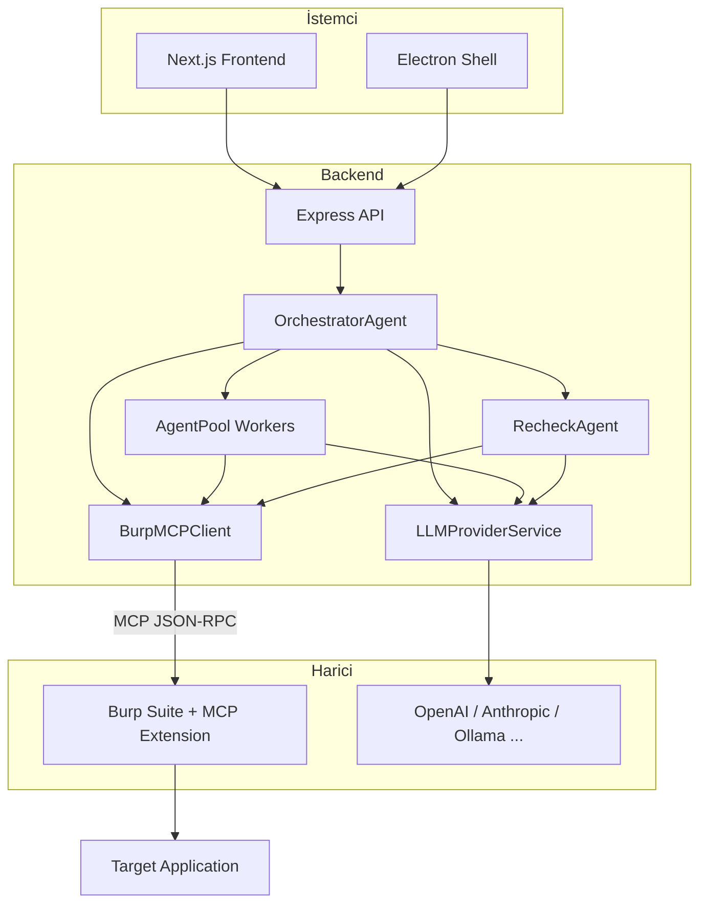

# PenPard Proje İnceleme Özeti

## Proje Ne İş Yapıyor?

**PenPard**, yetkili penetrasyon testleri için **yapay zeka destekli bir güvenlik test asistanıdır**. Özetle:

- **Otonom tarama:** LLM agent'ları hedef URL'yi planlar, Burp üzerinden gerçek HTTP istekleri gönderir, yanıtları analiz eder ve zafiyet raporlar.
- **Burp Suite entegrasyonu:** Özel bir Burp eklentisi (PenPard MCP Connect) MCP (Model Context Protocol) sunucusu açar; backend bu sunucuya JSON-RPC ile bağlanıp proxy history, sitemap, scanner, repeater, intruder gibi Burp özelliklerini kullanır.
- **Yanlış pozitif azaltma:** Her şüpheli bulgu bir **Recheck Agent** ile tekrar test edilir; sadece doğrulananlar rapora eklenir.
- **Tamamen yerel:** Veriler (hedef, bulgular, LLM prompt'ları) makineden dışarı çıkmaz; sadece seçtiğiniz LLM API'sine (OpenAI, Anthropic, DeepSeek, Ollama vb.) istek gider.

Kullanıcı tarayıcıda veya Electron masaüstü uygulamasında hedef ve "tarama talimatları" girer (örn. "sadece /login'de SQL injection test et"), scan başlatır; Mission Control ekranında canlı log, bulgular ve isteğe bağlı chat ile süreci izler. Duraklatıp manuel Burp testi yaparken **Smart Assist** manuel test pattern'ini algılayıp odaklı otomasyon önerebilir.

---

## Mimari (Yüksek Seviye)

- **Frontend:** `frontend/` — Next.js 14 (App Router), React 19, Tailwind, Zustand. Sayfalar: dashboard, web/mobile scan, scan detay (Mission Control), reports, settings, admin, token usage.
- **Backend:** `backend/` — Express, TypeScript, SQLite (better-sqlite3). REST API, JWT auth, agent'lar, Burp MCP istemcisi, rapor servisleri, aktivite monitörü.
- **Electron:** `electron/` — Masaüstü paketi; frontend + backend'i sarmalayıp Windows/macOS/Linux installer üretir.
- **Burp Extension:** `burp-extension/` — Kotlin, Gradle, Montoya API. NanoHTTPD ile `0.0.0.0:9876` (veya yapılandırılan port) üzerinde MCP sunucusu; 20+ tool (send_http_request, get_proxy_history, get_sitemap, send_to_scanner, send_to_repeater, encoding, scope vb.) sunar.

---

## Veri Akışı (Tarama Başlatıldığında)

1. **Kullanıcı** frontend'den hedef URL, talimatlar ve seçenekleri (paralel agent sayısı, rate limit vb.) gönderir.
2. **Backend** scan kaydı oluşturur, OrchestratorAgent başlatır.
3. **OrchestratorAgent** LLM ile planlama yapar (RECON → PLAN → EXECUTE → REPLAN döngüsü). Her adımda:
   - LLM hangi tool'u kullanacağına karar verir (send_http_request, get_sitemap, send_to_scanner vb.).
   - BurpMCPClient bu tool'ları Burp eklentisine JSON-RPC ile gönderir (`BURP_MCP_URL`, varsayılan `http://localhost:9876`).
   - Burp eklentisi isteği Burp proxy/scanner/repeater üzerinden çalıştırır; yanıt MCP ile backend'e döner.
   - Agent yanıtı LLM ile analiz eder; şüpheli zafiyet varsa RecheckAgent tetiklenir.
4. **RecheckAgent** ek payload'larla tekrar test eder; doğrulanan bulgular DB'ye yazılır.
5. Tarama bittiğinde **ReportService** PDF (ve isteğe bağlı DOCX/PPTX) raporu üretir.

**Instruction-Aware Scope:** Kullanıcı talimatları (örn. "sadece /login, sadece SQLi") LLM ile yapılandırılmış scope'a çevrilir; spider/sitemap gibi enumeration tool'ları bu scope'a göre kod tarafında kısıtlanabilir.

---

## Önemli Dosya ve Klasörler

| Bölüm                   | Konum | İşlev |
| ----------------------- | ----- | ----- |
| Uygulama girişi         | [backend/src/index.ts](../backend/src/index.ts) | Express sunucusu, route'lar, middleware |
| Burp ile iletişim       | [backend/src/services/burp-mcp.ts](../backend/src/services/burp-mcp.ts) | MCP URL çözümü (DB/ENV), health check, tool çağrıları |
| Tarama orkestrasyonu    | [backend/src/agents/OrchestratorAgent.ts](../backend/src/agents/OrchestratorAgent.ts) | Plan/Execute/Replan döngüsü, LLM prompt'ları, tool dispatch |
| Worker'lar              | [backend/src/agents/AgentPool.ts](../backend/src/agents/AgentPool.ts), [WorkerAgent.ts](../backend/src/agents/WorkerAgent.ts) | Paralel crawler/scanner/fuzzer/analyzer worker'ları |
| Doğrulama               | [backend/src/agents/RecheckAgent.ts](../backend/src/agents/RecheckAgent.ts) | Şüpheli bulguları ek payload'larla tekrar test eder |
| LLM                     | [backend/src/services/LLMProviderService.ts](../backend/src/services/LLMProviderService.ts), [llm.ts](../backend/src/services/llm.ts) | Çoklu provider (OpenAI, Azure, Anthropic, Gemini, DeepSeek, Ollama) |
| Aktivite / Smart Assist | [backend/src/services/ActivityMonitorService.ts](../backend/src/services/ActivityMonitorService.ts) | Burp proxy trafiğini izler; manuel test pattern'i algılayınca "Assist" önerir |
| Raporlar                | [backend/src/services/report.ts](../backend/src/services/report.ts) (PDF), report-docx, report-pptx, report-llm | Rapor üretimi ve LLM analizi |
| Veritabanı              | [backend/src/db/init.ts](../backend/src/db/init.ts) | SQLite şema, scans, vulnerabilities, settings, token_usage |
| Scan API                | [backend/src/routes/scans.ts](../backend/src/routes/scans.ts) | Scan oluşturma, listeleme, durum, Mission Control event'leri |
| Durum (Burp/LLM/MobSF)  | [backend/src/routes/status.ts](../backend/src/routes/status.ts) | Burp MCP health, LLM ve diğer bağlantı durumları |
| Burp eklentisi girişi   | [burp-extension/.../PenpardMcpExtension.kt](../burp-extension/src/main/kotlin/net/penpard/mcp/PenpardMcpExtension.kt) | Montoya API, MCP sunucusu başlatma |
| MCP tool'ları           | [burp-extension/.../ToolRegistry.kt](../burp-extension/src/main/kotlin/net/penpard/mcp/tools/ToolRegistry.kt) | Tüm MCP tool implementasyonları |

---

## Teknoloji Özeti

- **Frontend:** Next.js 14, React 19, Tailwind, Framer Motion, Zustand.
- **Backend:** Express, TypeScript, better-sqlite3, JWT, Winston.
- **AI:** OpenAI, Anthropic, Google Generative AI, DeepSeek, Ollama; queue ve multi-provider LLMProviderService + LLMQueue.
- **Burp Extension:** Kotlin 2.3, JVM 17, Montoya API 2025.2, Shadow JAR; MCP sunucusu NanoHTTPD.
- **Masaüstü:** Electron 36, electron-builder (NSIS/DMG/AppImage-deb).

---

## Özet

PenPard, **"Burp'u LLM ile yöneten tek merkez"** gibi düşünülebilir: kullanıcı hedef ve talimatı verir, AI agent'lar Burp MCP extension üzerinden gerçek istekleri atar ve yanıtları değerlendirir; bulgular doğrulanıp raporlanır. Veri yerelde kalır; maliyet büyük ölçüde seçilen LLM API kullanımına bağlıdır.
