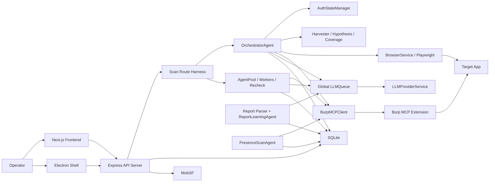

# PenPard Full-System Audit

## 1. Executive Summary

PenPard today is best modeled as a local-first, single-process, Burp-centric AI pentesting workbench with one clearly strongest execution path: a single [OrchestratorAgent](/Users/tcegerede/Desktop/penpard/backend/src/agents/OrchestratorAgent.ts) driving Burp-originated HTTP execution through [BurpMCPClient](/Users/tcegerede/Desktop/penpard/backend/src/services/burp-mcp.ts), optionally assisted by the real Playwright-based [BrowserService](/Users/tcegerede/Desktop/penpard/backend/src/services/BrowserService.ts), and backed by SQLite persistence in [db/init.ts](/Users/tcegerede/Desktop/penpard/backend/src/db/init.ts). That path is real, substantial, and operational. It includes auth-state handling, tool dispatch, live mission-control polling, source-aware testing modes, evidence capture, and report export.

The rest of the platform is not fake, but it is uneven. There is a real multi-agent lane via [AgentPool](/Users/tcegerede/Desktop/penpard/backend/src/agents/AgentPool.ts), [WorkerAgent](/Users/tcegerede/Desktop/penpard/backend/src/agents/WorkerAgent.ts), [SharedContext](/Users/tcegerede/Desktop/penpard/backend/src/agents/SharedContext.ts), and [RecheckAgent](/Users/tcegerede/Desktop/penpard/backend/src/agents/RecheckAgent.ts), but it is materially thinner than the single-agent path. It does not have parity for auth-state propagation, browser control, harvest/hypothesis/coverage loops, or execution richness. The code itself admits this by forcing authenticated scans back to single-agent mode in [scans.ts](/Users/tcegerede/Desktop/penpard/backend/src/routes/scans.ts).

PenPard also contains three genuine side-product lines: mobile scanning through [MobSFService](/Users/tcegerede/Desktop/penpard/backend/src/services/mobsf.ts), presence scanning through [presence-scan-agent.ts](/Users/tcegerede/Desktop/penpard/backend/src/agents/presence-scan-agent.ts), and report-learning/TTP extraction through [RedTeamReconstructionAgent.ts](/Users/tcegerede/Desktop/penpard/backend/src/agents/RedTeamReconstructionAgent.ts) plus [mindset-service.ts](/Users/tcegerede/Desktop/penpard/backend/src/services/mindset-service.ts). These are implemented, but they are not one coherent unified engine; they are separate execution lanes sharing the same app shell and database.

Architecturally, the strongest parts are:
- Real Burp execution rather than “LLM wrapper” behavior.
- A substantial single-agent orchestration loop with real stateful subsystems.
- A real browser harness with persistent Chromium profiles and Burp proxy routing.
- Persistent findings/log/chat/report/TTP storage.
- A real frontend control surface, not a dummy shell.

The weakest parts are:
- Orchestration state is overwhelmingly in memory, not durable.
- Restart/recovery is metadata recovery, not execution recovery.
- Multi-agent capability is advertised more broadly than it is truly implemented.
- Several visible features are disabled, partial, legacy, or no-op.
- Docs, scripts, schemas, and UI options drift from runtime reality.
- Stop/resume semantics are weaker than they appear, and stop-state correctness is currently flawed.

In practical terms: PenPard is already a real product, but it is not yet a resilient execution platform. It is a powerful local operator tool with a strong single-agent spine and several secondary systems around it.

## 2. System Topology

### Layer map

| Layer | Main implementation | Runtime owner | What it really does |
|---|---|---|---|
| UI shell | [frontend/src/app](/Users/tcegerede/Desktop/penpard/frontend/src/app), [electron/main.ts](/Users/tcegerede/Desktop/penpard/electron/main.ts) | Browser or Electron renderer/main | Presents scan creation, mission control, browser control, settings, presence scan, report analysis |
| API boundary | [backend/src/index.ts](/Users/tcegerede/Desktop/penpard/backend/src/index.ts) plus routes | Express process | Auth, scan creation/control, config, reporting, presence scan, browser, report-learning |
| Primary execution harness | [backend/src/routes/scans.ts](/Users/tcegerede/Desktop/penpard/backend/src/routes/scans.ts) | Express process | Chooses single-agent vs pool, owns active maps, launches async scan work |
| Single-agent scan engine | [backend/src/agents/OrchestratorAgent.ts](/Users/tcegerede/Desktop/penpard/backend/src/agents/OrchestratorAgent.ts) | In-process class instance | Planning, execution, auth-aware request sending, harvesting, browser-assisted flows, reporting |
| Parallel scan engine | [backend/src/agents/AgentPool.ts](/Users/tcegerede/Desktop/penpard/backend/src/agents/AgentPool.ts) | In-process class instance | Starts specialized workers + recheck, but with reduced capability set |
| Tool execution layer | [backend/src/services/burp-mcp.ts](/Users/tcegerede/Desktop/penpard/backend/src/services/burp-mcp.ts), [backend/src/services/BrowserService.ts](/Users/tcegerede/Desktop/penpard/backend/src/services/BrowserService.ts), [backend/src/services/LLMProviderService.ts](/Users/tcegerede/Desktop/penpard/backend/src/services/LLMProviderService.ts), [backend/src/services/LLMQueue.ts](/Users/tcegerede/Desktop/penpard/backend/src/services/LLMQueue.ts) | Process-local singletons | Executes HTTP/Burp/browser/LLM actions |
| Persistence layer | [backend/src/db/init.ts](/Users/tcegerede/Desktop/penpard/backend/src/db/init.ts) | SQLite file | Stores durable artifacts and metadata, not full live execution state |
| External execution boundary | [burp-extension/src/main/kotlin/net/penpard/mcp/tools/ToolRegistry.kt](/Users/tcegerede/Desktop/penpard/burp-extension/src/main/kotlin/net/penpard/mcp/tools/ToolRegistry.kt) | Burp JVM extension | Exposes Burp as MCP-accessible tool surface |
| Secondary product lanes | [presence-scan.ts](/Users/tcegerede/Desktop/penpard/backend/src/routes/presence-scan.ts), [report-analysis.ts](/Users/tcegerede/Desktop/penpard/backend/src/routes/report-analysis.ts), [mobsf.ts](/Users/tcegerede/Desktop/penpard/backend/src/services/mobsf.ts) | Same backend process | Presence scanning, report learning, mobile analysis |

### Runtime boundaries

1. Browser/web mode:
   - Frontend served separately.
   - Backend on port `4000`.
   - Burp extension on `9876`.
   - MobSF typically on `8000`.
   - Browser control launches Chromium on the backend host, not in the frontend browser.

2. Electron mode:
   - Electron main process starts backend as a child process.
   - Frontend is static-exported and served via `penpard://app/`.
   - Backend still listens on `localhost:4000`.
   - Same core backend code runs.

3. Burp boundary:
   - PenPard does not embed Burp logic in Node.
   - It relies on the Burp extension’s MCP server and tool contracts.
   - This is an actual hard integration boundary, not a library import.

4. Database boundary:
   - SQLite is authoritative for artifact persistence.
   - Active scan state remains outside the DB.

## 3. Execution Harness and Control Model

PenPard does not use a formal “harness” vocabulary consistently, but it does have clear harness-like structures in practice.

### Real harnesses in the live system

| Harness role | Actual implementation | Reality |
|---|---|---|
| Top-level application harness | [backend/src/index.ts](/Users/tcegerede/Desktop/penpard/backend/src/index.ts), [electron/main.ts](/Users/tcegerede/Desktop/penpard/electron/main.ts) | Starts services, mounts APIs, launches backend and frontend |
| Scan coordinator harness | [backend/src/routes/scans.ts](/Users/tcegerede/Desktop/penpard/backend/src/routes/scans.ts) | Owns active scan registries, launch decisions, stop/pause/resume routing |
| Single-agent worker harness | [backend/src/agents/OrchestratorAgent.ts](/Users/tcegerede/Desktop/penpard/backend/src/agents/OrchestratorAgent.ts) | True core scan brain |
| Parallel worker harness | [backend/src/agents/AgentPool.ts](/Users/tcegerede/Desktop/penpard/backend/src/agents/AgentPool.ts) + [backend/src/agents/WorkerAgent.ts](/Users/tcegerede/Desktop/penpard/backend/src/agents/WorkerAgent.ts) | Real but capability-reduced alternative path |
| Validation/recheck harness | [backend/src/agents/RecheckAgent.ts](/Users/tcegerede/Desktop/penpard/backend/src/agents/RecheckAgent.ts) | Confirms or weakly falls back suspected findings |
| Browser testing harness | [backend/src/services/BrowserService.ts](/Users/tcegerede/Desktop/penpard/backend/src/services/BrowserService.ts) + [backend/src/routes/browser.ts](/Users/tcegerede/Desktop/penpard/backend/src/routes/browser.ts) | Real dual-control browser execution surface |
| Hypothesis/coverage feedback harness | [RequestHarvester.ts](/Users/tcegerede/Desktop/penpard/backend/src/services/RequestHarvester.ts), [HypothesisEngine.ts](/Users/tcegerede/Desktop/penpard/backend/src/services/HypothesisEngine.ts), [CoverageTracker.ts](/Users/tcegerede/Desktop/penpard/backend/src/services/CoverageTracker.ts), [ResponseDiffer.ts](/Users/tcegerede/Desktop/penpard/backend/src/services/ResponseDiffer.ts) | Real and integrated only in single-agent path |
| Evidence/report harness | [backend/src/routes/reports.ts](/Users/tcegerede/Desktop/penpard/backend/src/routes/reports.ts), [report.ts](/Users/tcegerede/Desktop/penpard/backend/src/services/report.ts), [report-docx.ts](/Users/tcegerede/Desktop/penpard/backend/src/services/report-docx.ts), [report-pptx.ts](/Users/tcegerede/Desktop/penpard/backend/src/services/report-pptx.ts) | Export pipeline after scan artifacts exist |
| TTP-learning harness | [backend/src/routes/report-analysis.ts](/Users/tcegerede/Desktop/penpard/backend/src/routes/report-analysis.ts), [RedTeamReconstructionAgent.ts](/Users/tcegerede/Desktop/penpard/backend/src/agents/RedTeamReconstructionAgent.ts) | Separate knowledge-ingestion engine |
| Presence-scan harness | [backend/src/routes/presence-scan.ts](/Users/tcegerede/Desktop/penpard/backend/src/routes/presence-scan.ts), [presence-scan-agent.ts](/Users/tcegerede/Desktop/penpard/backend/src/agents/presence-scan-agent.ts) | Separate multi-target validation lane |

### Control model

The control model is process-local and singleton-heavy.

- `activeAgents`, `activePools`, and `scanLogCache` in [scans.ts](/Users/tcegerede/Desktop/penpard/backend/src/routes/scans.ts) are the live registry of active work.
- [browserService](/Users/tcegerede/Desktop/penpard/backend/src/services/BrowserService.ts) is a singleton with in-memory session maps.
- [llmQueue](/Users/tcegerede/Desktop/penpard/backend/src/services/LLMQueue.ts) is a single global serialization point for LLM usage.
- [activityMonitor](/Users/tcegerede/Desktop/penpard/backend/src/services/ActivityMonitorService.ts), [mcpManager](/Users/tcegerede/Desktop/penpard/backend/src/services/McpManagerService.ts), and prompt/analytics services are singleton services.
- Crash recovery is not “rebuild live graph from DB”; it is “mark orphaned DB rows interrupted and move on.”

This is a coherent local-app control model, but it is not a distributed or durable execution model.

## 4. End-to-End Scan Lifecycle

### Main web scan flow

1. The user creates a web scan from [frontend/src/app/scan/web/page.tsx](/Users/tcegerede/Desktop/penpard/frontend/src/app/scan/web/page.tsx).
   - Inputs include target URL, instructions, session cookies, optional IDOR users, parallel agent count, source-analysis inputs, and visible `Nuclei/FFUF` toggles.
   - `Nuclei/FFUF` are accepted by the UI but ignored by backend execution.

2. The frontend submits `POST /api/scans/web` to [backend/src/routes/scans.ts](/Users/tcegerede/Desktop/penpard/backend/src/routes/scans.ts).
   - The route authenticates through lock-screen JWT.
   - It checks whitelist membership.
   - Important reality: if the user has zero whitelist rows, `isWhitelisted()` returns `true`, so “no whitelist” means “allow all.”

3. Optional source code input is processed.
   - Local directory path is accepted directly.
   - ZIP is extracted under `/uploads/source-zips/<scanId>`.
   - Git is cloned under `/uploads/source-repos/<scanId>`.
   - Those stored source directories are not later cleaned automatically.
   - Because `/uploads` is statically served in [backend/src/index.ts](/Users/tcegerede/Desktop/penpard/backend/src/index.ts), uploaded artifacts live behind a weaker access boundary than scan APIs.

4. A scan row is created in SQLite via [createScan()](/Users/tcegerede/Desktop/penpard/backend/src/db/init.ts).

5. `startWebScan()` runs asynchronously in [scans.ts](/Users/tcegerede/Desktop/penpard/backend/src/routes/scans.ts).
   - Burp MCP availability is mandatory.
   - The route decides between single-agent and multi-agent mode.
   - If session cookies, IDOR users, or an auth-bearing Burp initial request exist and `parallelAgents > 1`, the code forces `parallelAgents = 1` because `AgentPool` does not safely propagate auth state.

6. Single-agent mode constructs [OrchestratorAgent](/Users/tcegerede/Desktop/penpard/backend/src/agents/OrchestratorAgent.ts).
   - Config includes rate limit, iteration limits, optional initial request, source-analysis mode, cookies, and IDOR users.
   - The agent is added to `activeAgents`.

7. `OrchestratorAgent.start()` runs.
   - `phaseInit()`:
     - Verifies Burp and LLM.
     - Initializes auth state from cookies, IDOR users, Burp history, and `initialRequest`.
     - Loads mindset/TTP context.
     - Optionally performs source analysis and stores its result on the scan row.
     - Analyzes operator instructions with the LLM for focused-scope enforcement.
     - Optionally launches/analyzes a browser session.
   - `phaseIterativeTesting()`:
     - Repeated PLAN → EXECUTE → HARVEST → DELTA ANALYSIS → REPLAN loop.
     - Up to five tool actions per plan step.
     - Uses Burp tools, browser tools, auth-aware HTTP dispatch, harvested-traffic promotion, hypothesis generation, coverage summary, response diffing.
   - `phaseReporting()`:
     - Generates a short executive summary with the LLM.
     - Marks the scan completed.
     - Cleans up browser session.

8. Request execution occurs through Burp.
   - The critical path is `executeSendHttpRequest()` inside [OrchestratorAgent](/Users/tcegerede/Desktop/penpard/backend/src/agents/OrchestratorAgent.ts).
   - It resolves auth identity, prepares merged headers/body through [AuthStateManager](/Users/tcegerede/Desktop/penpard/backend/src/services/auth/AuthStateManager.ts), emits warnings, deduplicates repeats, calls Burp `send_http_request`, tries to fetch raw evidence back from Burp history, and handles missing-auth `401` retry/refresh logic.

9. During execution, state splits into two buckets.
   - Persisted continuously or semi-continuously: scan status, findings, scan logs, chat messages, source-analysis result.
   - Memory-only: conversation history, current plan, auth graph, harvested traffic, hypotheses, coverage state, active browser page/context, active agent references.

10. Mission Control polls both `/api/scans/:id` and `/api/scans/:id/live` from [MissionControlClient.tsx](/Users/tcegerede/Desktop/penpard/frontend/src/app/scan/[id]/MissionControlClient.tsx).
    - `/scans/:id` is DB-backed status + vulnerabilities.
    - `/scans/:id/live` returns memory-backed live state when active, otherwise cache/DB-backed fallback.

11. Stop/pause/resume/continue routes exist.
    - `pause` and `resume` only affect active in-memory agents/pools.
    - `continue` does not resume the old in-memory state. It constructs a fresh `OrchestratorAgent`, restores a subset of DB-backed findings/endpoints, and continues from a new live state.
    - `stop` has a correctness issue: both `OrchestratorAgent.start()` and `startWebScan()` still continue into completion/reporting logic after `stop()` sets `isRunning = false`, so stopped scans can be overwritten back to `completed`. The same risk exists in the pool path.

12. Report download/export is separate from scan execution.
    - `/api/reports/:scanId/download` generates or reuses report files.
    - Reports are also served under static `/reports`, bypassing route-level auth checks if the path is known.

### Burp-originated scan flow

1. Burp context menu in [SendToPenPardContextMenu.kt](/Users/tcegerede/Desktop/penpard/burp-extension/src/main/kotlin/net/penpard/mcp/ui/SendToPenPardContextMenu.kt) posts raw request text to [backend/src/routes/penpard.ts](/Users/tcegerede/Desktop/penpard/backend/src/routes/penpard.ts).
2. The backend places it into an in-memory pending map keyed by request ID.
3. The dashboard sees pending Burp requests and can trigger `/api/scans/from-burp`.
4. That route consumes the queued raw request, parses it with [burp-request.ts](/Users/tcegerede/Desktop/penpard/backend/src/services/burp-request.ts), saves it to `scans.initial_request`, and launches the same main web-scan path.
5. Because the queue is in memory only, backend restart or TTL expiry loses the request.

### Mobile scan flow

1. The user uploads an APK from [frontend/src/app/scan/mobile/page.tsx](/Users/tcegerede/Desktop/penpard/frontend/src/app/scan/mobile/page.tsx).
2. [scans.ts](/Users/tcegerede/Desktop/penpard/backend/src/routes/scans.ts) creates a `mobile` scan row.
3. `startMobileScan()` calls [MobSFService](/Users/tcegerede/Desktop/penpard/backend/src/services/mobsf.ts).
4. MobSF upload/scan/report APIs are called directly.
5. Findings are mapped into the shared `vulnerabilities` table.
6. Uploaded APK cleanup is not visible in the reviewed code.

### Presence scan flow

1. The user selects TTPs and target lists from [frontend/src/app/presence-scan/page.tsx](/Users/tcegerede/Desktop/penpard/frontend/src/app/presence-scan/page.tsx).
2. [presence-scan.ts](/Users/tcegerede/Desktop/penpard/backend/src/routes/presence-scan.ts) creates a run row plus join rows for TTPs.
3. [PresenceScanAgent](/Users/tcegerede/Desktop/penpard/backend/src/agents/presence-scan-agent.ts) iterates targets × TTPs, sending safe GET/HEAD/OPTIONS-style requests through Burp.
4. Results are aggregated per target, not per target×TTP row.
5. The route claims `ttp_id` result filtering, but per-target result rows do not actually carry `ttp_id`, so that filter path is structurally broken.

### Report-learning flow

1. The user uploads a PDF/DOCX report from [frontend/src/app/analyze-report/page.tsx](/Users/tcegerede/Desktop/penpard/frontend/src/app/analyze-report/page.tsx).
2. [report-analysis.ts](/Users/tcegerede/Desktop/penpard/backend/src/routes/report-analysis.ts) stores the analysis record and extracted findings.
3. [ReportLearningAgent](/Users/tcegerede/Desktop/penpard/backend/src/agents/RedTeamReconstructionAgent.ts) derives reusable TTPs and rebuilds the mindset profile.
4. The resulting TTP library feeds future scan planning through [mindset-service.ts](/Users/tcegerede/Desktop/penpard/backend/src/services/mindset-service.ts).

## 5. Agent-by-Agent Deep Analysis

### OrchestratorAgent

**Responsibility**

[OrchestratorAgent](/Users/tcegerede/Desktop/penpard/backend/src/agents/OrchestratorAgent.ts) is the real core of PenPard’s web scanning architecture. It owns planning, tool dispatch, auth-aware request execution, browser-assisted exploration, harvested-traffic testing, coverage feedback, logging, and end-of-scan summarization.

**Lifecycle**

- Constructed by [scans.ts](/Users/tcegerede/Desktop/penpard/backend/src/routes/scans.ts).
- Registered in `activeAgents`.
- Runs `phaseInit()` → `phaseIterativeTesting()` → `phaseReporting()`.
- Flushes logs and is removed from registry on exit.

**State model**

Most important state is in memory:
- Conversation history
- Findings array
- Discovered endpoints set
- Auth manager
- Browser session ID and transition state
- Request harvester
- Hypothesis engine
- Coverage tracker
- Human command queue
- Plan rounds and current plan

Persisted state is partial:
- Scan status
- Vulnerabilities table
- Scan logs
- Chat messages
- Source-analysis result on scan row

**Dependencies**

- [BurpMCPClient](/Users/tcegerede/Desktop/penpard/backend/src/services/burp-mcp.ts)
- [LLMQueue](/Users/tcegerede/Desktop/penpard/backend/src/services/LLMQueue.ts)
- [AuthStateManager](/Users/tcegerede/Desktop/penpard/backend/src/services/auth/AuthStateManager.ts)
- [BrowserService](/Users/tcegerede/Desktop/penpard/backend/src/services/BrowserService.ts)
- [RequestHarvester](/Users/tcegerede/Desktop/penpard/backend/src/services/RequestHarvester.ts)
- [HypothesisEngine](/Users/tcegerede/Desktop/penpard/backend/src/services/HypothesisEngine.ts)
- [CoverageTracker](/Users/tcegerede/Desktop/penpard/backend/src/services/CoverageTracker.ts)
- [ResponseDiffer](/Users/tcegerede/Desktop/penpard/backend/src/services/ResponseDiffer.ts)

**Strengths**

- This is the most mature subsystem in the repo.
- It has real auth-aware request execution and 401 recovery.
- It has code-level enforcement for focused-scope instructions.
- It integrates browser, Burp, auth, harvesting, and coverage into one loop.
- It captures evidence more rigorously than the rest of the system.

**Weaknesses**

- It is too stateful to recover across restart.
- It is tied to a single process and global singletons.
- `stop()` sets `isRunning = false`, but `start()` still proceeds into reporting afterward; stop semantics are not reliably terminal.
- Conversation and request-history growth are bounded only loosely.
- It is very large and functionally dense, making future modification risky.

### AgentPool

**Responsibility**

[AgentPool](/Users/tcegerede/Desktop/penpard/backend/src/agents/AgentPool.ts) coordinates multiple workers plus a recheck agent around a shared context.

**Lifecycle**

- Created by [scans.ts](/Users/tcegerede/Desktop/penpard/backend/src/routes/scans.ts) when `parallelAgents > 1`.
- Adds target to Burp scope.
- Seeds one initial endpoint.
- Creates workers by role distribution.
- Starts `RecheckAgent`.
- Waits for workers to finish, then reports complete.

**Strengths**

- It is real, not stubbed.
- It has clear role distribution and shared event routing.
- It persists findings to the main vulnerability table.

**Weaknesses**

- It is much thinner than the single-agent architecture.
- Logs are persisted only at the end, not incrementally.
- It has no auth-state parity, which is why auth-bearing scans are forced out of this path.
- It has no browser parity and no harvest/coverage/hypothesis parity.
- `stop()` does not prevent `start()` from later reaching completion/reporting logic, so stop-state correctness is weak here too.

### WorkerAgent

**Responsibility**

[WorkerAgent](/Users/tcegerede/Desktop/penpard/backend/src/agents/WorkerAgent.ts) is a lightweight role-specialized LLM loop for `crawler`, `scanner`, `fuzzer`, and `analyzer`.

**Reality check**

The role prompts promise broad behavior, but the actual tool execution surface is extremely small:
- `send_http_request`
- `get_proxy_history`

Workers do not execute the richer Burp tool set their prompts imply. They also do not have auth-state, browser control, coverage loops, or sophisticated request reconstruction. This is a major intended-vs-actual mismatch.

### SharedContext

**Responsibility**

[SharedContext](/Users/tcegerede/Desktop/penpard/backend/src/agents/SharedContext.ts) is the pool’s shared mutable state and event bus.

**Reality check**

The file comment says “Thread-safe data structure.” That is misleading. It is a plain `EventEmitter` plus mutable maps/arrays in a single Node process. It is safe only in the ordinary JavaScript event-loop sense. It is not a concurrency-safe shared memory primitive.

### RecheckAgent

**Responsibility**

[RecheckAgent](/Users/tcegerede/Desktop/penpard/backend/src/agents/RecheckAgent.ts) listens for `vulnerability:suspected`, performs extra payload testing, then asks the LLM to confirm or reject.

**Strengths**

- It is a real second-pass validator.
- It helps reduce naive LLM false positives.

**Weaknesses**

- If recheck errors, it falls back to adding a low-severity unverified vulnerability rather than dropping it. That biases toward retained false positives.
- It uses the same global `LLMQueue`, so it competes with the main scan loop and can slow all other work.

### PresenceScanAgent

**Responsibility**

[PresenceScanAgent](/Users/tcegerede/Desktop/penpard/backend/src/agents/presence-scan-agent.ts) performs presence checks across target lists using reusable TTP templates.

**Strengths**

- It is deterministic enough to be credible.
- It safely constrains request style and redirect handling.
- It stores per-target evidence.

**Weaknesses**

- Storage model is target-aggregated while the API suggests finer TTP filtering.
- It is a separate product lane, not integrated into the main scan harness.

### ReportLearningAgent

**Responsibility**

[ReportLearningAgent](/Users/tcegerede/Desktop/penpard/backend/src/agents/RedTeamReconstructionAgent.ts) ingests parsed pentest findings and derives reusable TTP structures plus an aggregated mindset profile.

**Strengths**

- It is a real feedback/learning subsystem.
- Its outputs are durable and actually reused by scan planning.

**Weaknesses**

- It is heavily heuristic/LLM-based.
- Regeneration/playbook management semantics in the UI overpromise more control than the backend actually exposes.

## 6. Service-by-Service Deep Analysis

### LLMProviderService

[LLMProviderService](/Users/tcegerede/Desktop/penpard/backend/src/services/LLMProviderService.ts) is the multi-provider abstraction for OpenAI, Anthropic, Gemini, DeepSeek, and Ollama. It is central and operational. It logs token usage and is the authoritative provider layer.

Key misalignment:
- The config type includes `qwen`, but the provider switch does not implement a `qwen` execution path. The type system and token-usage UI imply a provider the runtime cannot actually use.

### LLMQueue

[LLMQueue](/Users/tcegerede/Desktop/penpard/backend/src/services/LLMQueue.ts) is operational and critical. It is also one of the biggest architectural bottlenecks.

Verified characteristics:
- Global singleton
- Process-local
- `maxConcurrent = 1`
- Inter-request delay
- Timeout and small retry logic

Practical implication:
- Single-agent scans, worker agents, recheck, report learning, source analysis, and report enhancement all serialize through one lane.
- The codebase talks about multi-agent capability, but LLM concurrency is effectively centralized.

### BurpMCPClient

[burp-mcp.ts](/Users/tcegerede/Desktop/penpard/backend/src/services/burp-mcp.ts) is central and real. It dynamically reads Burp config from DB/environment and calls MCP tools.

Strength:
- Burp is a true execution boundary, not theater.

Weakness:
- Legacy methods remain, including `scan()`, but the main web scan path does not use them.
- Core correctness depends on extension tool contracts staying aligned with backend assumptions.

### BrowserService

[BrowserService](/Users/tcegerede/Desktop/penpard/backend/src/services/BrowserService.ts) is a real browser harness with persistent contexts, visible/headless transitions, script execution, state capture, storage dump, frontend analysis, correlation, screenshots, and proxy routing.

Strength:
- This is one of the most substantial subsystems after the orchestrator.
- It meaningfully supports “human + AI” interaction.

Weaknesses:
- Live sessions are memory-only.
- Browser profile directories under `~/.penpard/browser_sessions/<sessionId>` are not cleaned up by `closeSession()` or closed-session DB deletion.
- There is no confirmed backend shutdown hook wiring into browser cleanup.
- It intentionally weakens browser protections for testing, which is acceptable for local security tooling but should be mentally modeled as a test harness, not a secure browser sandbox.

### Auth subsystem

Files:
- [AuthStateManager.ts](/Users/tcegerede/Desktop/penpard/backend/src/services/auth/AuthStateManager.ts)
- [AuthCapture.ts](/Users/tcegerede/Desktop/penpard/backend/src/services/auth/AuthCapture.ts)
- [AuthInjector.ts](/Users/tcegerede/Desktop/penpard/backend/src/services/auth/AuthInjector.ts)
- [TokenStore.ts](/Users/tcegerede/Desktop/penpard/backend/src/services/auth/TokenStore.ts)
- [IdentityRegistry.ts](/Users/tcegerede/Desktop/penpard/backend/src/services/auth/IdentityRegistry.ts)
- [CookieJar.ts](/Users/tcegerede/Desktop/penpard/backend/src/services/auth/CookieJar.ts)
- [SessionHealthMonitor.ts](/Users/tcegerede/Desktop/penpard/backend/src/services/auth/SessionHealthMonitor.ts)
- [CSRFManager.ts](/Users/tcegerede/Desktop/penpard/backend/src/services/auth/CSRFManager.ts)

This subsystem is now a real execution-critical service cluster. It captures cookies and bearer tokens from Burp history, browser storage, operator input, explicit requests, and initial Burp requests; selects identities; injects auth material; probes session health; and attempts refresh/relogin strategies.

Strength:
- It is one of the most structurally advanced parts of the backend now.
- It fixed the old ad hoc “headers happen to survive” model with an explicit auth-state model.

Caution:
- It lives mostly inside a single-agent scan instance.
- Multi-identity logic exists inside an application that is otherwise fundamentally single-operator at the UI/auth level.
- Session health/relogin complexity is much greater than the rest of the platform’s persistence model can durably support.

### RequestHarvester, HypothesisEngine, CoverageTracker, ResponseDiffer

These files form the most “next-generation” part of the single-agent scan loop:
- [RequestHarvester.ts](/Users/tcegerede/Desktop/penpard/backend/src/services/RequestHarvester.ts)
- [HypothesisEngine.ts](/Users/tcegerede/Desktop/penpard/backend/src/services/HypothesisEngine.ts)
- [CoverageTracker.ts](/Users/tcegerede/Desktop/penpard/backend/src/services/CoverageTracker.ts)
- [ResponseDiffer.ts](/Users/tcegerede/Desktop/penpard/backend/src/services/ResponseDiffer.ts)

They are not decorative. They are integrated into the orchestrator and used for harvested-traffic promotion, mutation testing, differential analysis, workflow coverage, and coverage-aware replanning.

Strength:
- This is a meaningful harness for traffic-driven testing and coverage-aware planning.

Weakness:
- It is fully memory-resident.
- It disappears on restart and is not resumable.
- It exists only in the single-agent path.

### Source analysis services

Files:
- [SourceAnalysisService.ts](/Users/tcegerede/Desktop/penpard/backend/src/services/source-analysis/SourceAnalysisService.ts)
- [VersionAwareAnalysisService.ts](/Users/tcegerede/Desktop/penpard/backend/src/services/source-analysis/VersionAwareAnalysisService.ts)
- [FullSourceAnalysisService.ts](/Users/tcegerede/Desktop/penpard/backend/src/services/source-analysis/FullSourceAnalysisService.ts)
- [SourceReportEnricher.ts](/Users/tcegerede/Desktop/penpard/backend/src/services/source-analysis/SourceReportEnricher.ts)
- Route utilities under [utils/](/Users/tcegerede/Desktop/penpard/backend/src/services/source-analysis/utils)

These are real and operational. They extract dependency inventories, CVE hints, route maps, module/function summaries, and testing hints. Results are stored on the scan row.

Strength:
- The source-aware feature is not marketing-only; it materially affects scan context.

Weakness:
- “Full source aware” insight is still heavily LLM/heuristic-driven, not formal static analysis.
- Git-based endpoint preview routes are currently broken by an argument-order bug in [scans.ts](/Users/tcegerede/Desktop/penpard/backend/src/routes/scans.ts): `cloneGitRepository()` is called with `destDir` and `token` swapped in the extract-preview routes, though the actual scan-start routes use the correct order.

### PromptLibraryService

[PromptLibraryService.ts](/Users/tcegerede/Desktop/penpard/backend/src/services/PromptLibraryService.ts) is real but auxiliary. It manages built-ins plus remote prompt catalog caching.

Important reality:
- The built-in “default” scan prompt entry has an empty template.
- The real default web-scan behavior lives in [OrchestratorAgent.ts](/Users/tcegerede/Desktop/penpard/backend/src/agents/OrchestratorAgent.ts), not in the prompt library.
- So the prompt library is a configuration/catalog layer, not the primary prompt source of truth.

### mindset-service

[mindset-service.ts](/Users/tcegerede/Desktop/penpard/backend/src/services/mindset-service.ts) is operational and meaningful. It composes accumulated TTPs into a reusable planning profile. This is one of the more coherent “learning loop” subsystems.

### Report services

Files:
- [report.ts](/Users/tcegerede/Desktop/penpard/backend/src/services/report.ts)
- [report-docx.ts](/Users/tcegerede/Desktop/penpard/backend/src/services/report-docx.ts)
- [report-pptx.ts](/Users/tcegerede/Desktop/penpard/backend/src/services/report-pptx.ts)
- [report-llm.ts](/Users/tcegerede/Desktop/penpard/backend/src/services/report-llm.ts)
- [report-parser.ts](/Users/tcegerede/Desktop/penpard/backend/src/services/report-parser.ts)

These are real and used. Static PDF caching exists. DOCX/PPTX and LLM-enhanced variants are generated on demand.

Security/correctness caveat:
- Authenticated report routes exist, but static `/reports` serving in [index.ts](/Users/tcegerede/Desktop/penpard/backend/src/index.ts) bypasses those checks if the file path is known.

### ActivityMonitorService

[ActivityMonitorService.ts](/Users/tcegerede/Desktop/penpard/backend/src/services/ActivityMonitorService.ts) is implemented but code-disabled with `ASSIST_ENABLED = false`.

That means:
- The service exists.
- The frontend auto-starts it.
- Mission Control pause text says PenPard is watching manual testing.
- But suggestion generation is disabled at runtime.

This is a concrete promise-vs-reality gap.

### McpManagerService

[McpManagerService.ts](/Users/tcegerede/Desktop/penpard/backend/src/services/McpManagerService.ts) is a generic MCP process manager. It starts configured commands from the DB with `shell: true`, captures logs, and exposes status to the UI.

Reality:
- It is operational.
- It is not central to scan execution.
- The main scan path depends on Burp MCP directly, not on this generic manager.
- It adds platform ambition, but not much core scan value today.

### MobSFService

[MobSFService.ts](/Users/tcegerede/Desktop/penpard/backend/src/services/mobsf.ts) is direct and simple. It uploads APKs, kicks off scans, pulls JSON reports, and maps findings into PenPard vulnerabilities.

Reality:
- Mobile scanning is basically a MobSF wrapper lane.
- It is valid, but much simpler than the web scanning architecture.

### Infrastructure and auxiliary utilities

- [target-parser.ts](/Users/tcegerede/Desktop/penpard/backend/src/services/target-parser.ts) is a clean presence-target parser.
- [http-request-builder.ts](/Users/tcegerede/Desktop/penpard/backend/src/services/http-request-builder.ts) is solid helper logic for presence-scan requests and includes module-load self-tests.
- [source-fetcher.ts](/Users/tcegerede/Desktop/penpard/backend/src/utils/source-fetcher.ts) supports directory picking, ZIP extraction, and Git clone. It is practical but local-host-biased.
- [httpsServer.ts](/Users/tcegerede/Desktop/penpard/backend/src/services/httpsServer.ts) exists but is not wired into backend startup. It is currently configured-but-unused.
- [analytics.ts](/Users/tcegerede/Desktop/penpard/backend/src/services/analytics.ts) and token-usage logging are operational, but not execution-critical.

## 7. Tooling and Integration Boundaries

### Burp + MCP boundary

The Burp extension is a real remote execution boundary:
- [PenpardMcpExtension.kt](/Users/tcegerede/Desktop/penpard/burp-extension/src/main/kotlin/net/penpard/mcp/PenpardMcpExtension.kt)
- [ToolRegistry.kt](/Users/tcegerede/Desktop/penpard/burp-extension/src/main/kotlin/net/penpard/mcp/tools/ToolRegistry.kt)
- [McpServer.kt](/Users/tcegerede/Desktop/penpard/burp-extension/src/main/kotlin/net/penpard/mcp/server/McpServer.kt)

Verified facts:
- Default host is `0.0.0.0`.
- Default port is `9876`.
- Token auth is optional, not mandatory.
- The extension tags PenPard-originated proxy requests and strips the tag before target delivery.

Important mismatch:
- Tool registration still documents `send_http_request` primarily as raw `host/port/useHttps/request`.
- Implementation also supports structured `{ method, url, headers, body }`.
- Backend relies heavily on the structured path.
- The schema and the real tool contract are out of sync.

### Browser boundary

The browser subsystem is not a browser extension inside the frontend. It is a backend-side Playwright harness plus a separate branding extension loaded into Chromium from [electron/assets/browser-extension](/Users/tcegerede/Desktop/penpard/electron/assets/browser-extension/manifest.json).

Reality:
- It is local-host tooling.
- It launches and controls Chromium on the backend machine.
- It routes through Burp proxy config, not the MCP port.
- It is real in Electron and local web usage, but not a generic remote browser execution service.

### Electron boundary

[main.ts](/Users/tcegerede/Desktop/penpard/electron/main.ts) is a real desktop shell, not a trivial wrapper. It:
- Starts the backend child process
- Serves exported frontend assets over `penpard://app/`
- Exposes IPC for restart, logs, cache/data deletion, updater actions
- Enforces single-instance lock

Caution:
- Backend readiness uses log parsing plus a 10-second fallback timeout, which is serviceable but brittle.
- Some “advanced” cleanup actions remove DB/log files without a fully orchestrated rebootstrap flow.

### Frontend boundary

The frontend is a real runtime controller:
- Dashboard lists scans and pending Burp requests.
- Web/mobile scan pages launch actual backend work.
- Mission Control polls real live state.
- Browser page drives the backend browser harness.
- Presence scan and report analysis are full UIs.

But it also overstates or misstates some features:
- Smart Assist appears alive but is disabled.
- Nuclei/FFUF toggles exist but are no-ops.
- Admin scan logs UI is placeholder-only.
- Runtime API URL override helper exists, but most calls still import `API_URL` directly.

### Database boundary

SQLite is authoritative for durable artifacts, but not for live orchestration. That distinction is central to understanding PenPard’s reliability envelope.

### External tools boundary

| External tool | Actual role | Reality |
|---|---|---|
| Burp Suite Pro | Core web execution engine | Mandatory for real web scanning |
| LLM APIs / Ollama | Planning, reasoning, summaries, TTP extraction | Mandatory for most intelligent features |
| MobSF | Entire mobile-analysis backend | Mobile lane depends on it |
| Git / ZIP / local FS | Source-aware scan inputs | Real, but local-host-biased and partly leaky |
| Nuclei | Status check only | Not integrated into scan execution |
| FFUF | UI flag only | Not integrated into scan execution |

## 8. State, Persistence, and Recovery Model

### Durable vs ephemeral state

| State | Where it lives | Survives restart? | Notes |
|---|---|---|---|
| Scan rows/status | SQLite `scans` | Yes | Status survives, live execution does not |
| Vulnerabilities | SQLite `vulnerabilities` | Yes | Durable findings/evidence |
| Scan logs | SQLite `scan_logs` | Partly | Single-agent flushes incrementally; pool flushes mainly at finish |
| Chat messages | SQLite `scan_chat_messages` | Yes | Used for continuation UI |
| Reports metadata | SQLite `reports` | Yes | Static PDF cache tracked |
| Source-analysis results | `scans.source_analysis_result_json` | Yes | Durable per scan |
| Report analyses / TTPs / mindset | SQLite analysis tables | Yes | Durable mini-product |
| Presence scan runs/results | SQLite presence tables | Yes | Durable mini-product |
| Browser session metadata/actions | SQLite `browser_sessions`, `browser_actions` | Yes | Metadata only |
| Live browser objects | Memory in `BrowserService.sessions` | No | Lost on restart |
| Active agents/pools | Memory in `activeAgents`, `activePools` | No | Core execution brain lost |
| Burp pending request queue | Memory in [penpard.ts](/Users/tcegerede/Desktop/penpard/backend/src/routes/penpard.ts) | No | TTL-based transient queue |
| AuthStateManager graph | Memory in OrchestratorAgent | No | Lost on restart/continue |
| Conversation history | Memory in OrchestratorAgent | No | Not persisted as a conversation transcript |
| Harvester/hypothesis/coverage state | Memory in OrchestratorAgent | No | Lost on restart |
| Activity-monitor suggestions | Memory in ActivityMonitorService | No | Also disabled in practice |
| Generic MCP process map | Memory in McpManagerService | No | DB only stores configs/status |

### Recovery model

Recovery today is artifact recovery, not execution recovery.

Verified behavior:
- On startup, [recoverOrphanedScans()](/Users/tcegerede/Desktop/penpard/backend/src/db/init.ts) marks non-terminal scans as `interrupted`.
- There is no mechanism to reconstruct an Orchestrator’s conversation, auth graph, browser session, harvest pool, or current plan from DB.
- “Continue scan” is a new agent seeded with some old artifacts, not a resumed execution graph.

### Reliability implications

- Long scans are vulnerable to process death.
- Multi-step auth/session/browser context is fragile across restart.
- Browser metadata may suggest continuity, but live Playwright objects are gone.
- Pool logs are especially lossy if a crash happens before final flush.
- Browser profile directories accumulate on disk even when DB rows are deleted.

### Operator/auth model implications

The schema looks multi-user, but live application behavior does not.

Verified facts:
- Lock-screen auth is the real product auth.
- `/auth/verify-key` always issues a JWT for user ID `1`.
- The seeded operator user is `operator`, role `super_admin`.
- CLI user management exists in [cli.ts](/Users/tcegerede/Desktop/penpard/backend/src/cli.ts), but the runtime UI/auth path does not use username/password login.
- [docs/API.md](/Users/tcegerede/Desktop/penpard/docs/API.md) still documents `/auth/login`, which does not exist in [auth.ts](/Users/tcegerede/Desktop/penpard/backend/src/routes/auth.ts).

PenPard should therefore be mentally modeled as a single-operator app with multi-user-looking tables.

## 9. Frontend-to-Backend Reality Check

### What the UI honestly reflects

- [dashboard/page.tsx](/Users/tcegerede/Desktop/penpard/frontend/src/app/dashboard/page.tsx) is a real operational dashboard.
- [scan/web/page.tsx](/Users/tcegerede/Desktop/penpard/frontend/src/app/scan/web/page.tsx) genuinely drives scan creation and source-aware options.
- [scan/[id]/MissionControlClient.tsx](/Users/tcegerede/Desktop/penpard/frontend/src/app/scan/[id]/MissionControlClient.tsx) genuinely reflects live backend state.
- [browser/page.tsx](/Users/tcegerede/Desktop/penpard/frontend/src/app/browser/page.tsx) genuinely drives BrowserService.
- [presence-scan/page.tsx](/Users/tcegerede/Desktop/penpard/frontend/src/app/presence-scan/page.tsx) and [analyze-report/page.tsx](/Users/tcegerede/Desktop/penpard/frontend/src/app/analyze-report/page.tsx) are real control surfaces.

### Where UI promise exceeds backend reality

- Smart Assist:
  - UI auto-starts monitoring and mission control says PenPard is watching.
  - Backend service is hard-disabled.

- Nuclei/FFUF:
  - Visible toggles and form plumbing exist.
  - Backend logs warnings and ignores them.

- Admin logs:
  - Backend has `/api/admin/logs`.
  - Admin UI “Scan Logs” tab is placeholder text.

- Multi-user posture:
  - UI auth feels like a login gate.
  - Backend is actually single-operator lock-key auth.

- Report-analysis playbook regeneration:
  - UI offers refresh-like behavior.
  - Backend returns cached playbook content unless cache is absent; there is no explicit force-regenerate API in the reviewed path.

- API URL configurability:
  - [api-config.ts](/Users/tcegerede/Desktop/penpard/frontend/src/lib/api-config.ts) supports localStorage override.
  - Most frontend modules import constant `API_URL` directly, so the helper is more aspirational than effective.

### UX vs runtime mismatch on control semantics

The most important mismatch is stop/resume.

The UI suggests:
- pause = safe suspension
- resume = continuation
- stop = terminal abort
- continue = resume-like follow-on work

Actual backend reality:
- `pause` and `resume` only work while the active agent object still exists in memory.
- `continue` is a fresh agent with partial restored artifacts.
- `stop` does not reliably remain stopped because completion/reporting logic can still execute afterward.

## 10. Implementation Gaps and Misalignments

### Critical or high-impact gaps

1. **Stop-state correctness is unreliable**
   - In [OrchestratorAgent.start()](/Users/tcegerede/Desktop/penpard/backend/src/agents/OrchestratorAgent.ts), `stop()` only flips `isRunning` and phase, but `start()` still calls `phaseReporting()` after iterative testing exits.
   - In [scans.ts](/Users/tcegerede/Desktop/penpard/backend/src/routes/scans.ts), `startWebScan()` also unconditionally writes `completed` at the end of the happy path.
   - The pool path has the same pattern.
   - Result: stopped scans can be overwritten back to completed.

2. **Authenticated multi-agent scanning is not actually supported**
   - The system explicitly forces auth-bearing scans to single-agent mode.
   - This is the correct safety choice today, but it means the platform’s “parallel agent” story does not apply to one of the most important real-world cases.

3. **Static `/reports` and `/uploads` bypass authenticated route controls**
   - [index.ts](/Users/tcegerede/Desktop/penpard/backend/src/index.ts) serves both directories directly.
   - Reports, source zips/repos, and uploaded APK-related artifacts sit behind a weaker boundary than the API suggests.

4. **Smart Assist is presented as live while disabled**
   - This is not a minor doc drift; it changes operator expectations during pause/manual testing.

### Medium-impact gaps

5. **Presence scan result filtering is semantically broken**
   - The API supports `ttp_id` filtering.
   - Stored per-target rows do not actually have per-row `ttp_id`.

6. **Git-based endpoint extraction preview path is broken**
   - In [scans.ts](/Users/tcegerede/Desktop/penpard/backend/src/routes/scans.ts), both `/extract-endpoints` and `/extract-endpoints-ai` call `cloneGitRepository()` with swapped `token` and `destDir` arguments.
   - The actual scan-start paths use the correct order, so this bug is narrow but real.

7. **Prompt library is not the actual default prompt source**
   - The “default prompt” catalog entry is mostly metadata.
   - True default behavior still lives in OrchestratorAgent constants and system prompt assembly.

8. **Worker prompts promise broader tooling than workers actually execute**
   - Worker roles imply crawler/scanner/fuzzer/analyzer richness.
   - The actual worker tool executor supports only `send_http_request` and `get_proxy_history`.

9. **Report-analysis playbook regeneration is not really regeneration**
   - Frontend behavior suggests re-generation.
   - Backend reviewed path is cache-first with no explicit force flag.

10. **Generic MCP manager is real but largely isolated from core scan execution**
   - It adds platform breadth more than core capability.

### Lower-level or legacy drift

11. **Unused HTTPS server service**
   - [httpsServer.ts](/Users/tcegerede/Desktop/penpard/backend/src/services/httpsServer.ts) is substantial but not wired into startup.

12. **Legacy/unused scan schema columns**
   - `burp_scan_id`, `mobsf_hash`, `rate_limit`, `recursion_depth`, `use_nuclei`, `use_ffuf`, `idor_users_json`, `orchestrator_logs_path` remain in schema but are not the live source of truth for current orchestration behavior.

13. **Report row `format` is stale**
   - Current report path does not really use the field as a durable source of truth.

14. **Provider/config drift**
   - `qwen` appears in backend type and frontend token-usage styling, but not in actual LLM execution or config UI.

15. **Documentation drift**
   - [docs/API.md](/Users/tcegerede/Desktop/penpard/docs/API.md) documents `/auth/login`, which is not implemented.
   - [docs/ARCHITECTURE.md](/Users/tcegerede/Desktop/penpard/docs/ARCHITECTURE.md) describes Smart Assist as active and references a nonexistent `services/llm.ts`.
   - [README.md](/Users/tcegerede/Desktop/penpard/README.md) claims GPL-3.0 in the comparison table while package manifests use PolyForm Noncommercial.

16. **Repo/runtime artifact drift**
   - [burp-extension/bin/main](/Users/tcegerede/Desktop/penpard/burp-extension/bin/main/net/penpard/mcp/ToolRegistry.kt) is a checked-in compiled/mirrored artifact tree with no visible runtime consumers in the repo.
   - Root package script `hashes` points to missing `scripts/calculate-hashes.js`.
   - Frontend declares `test: jest` without a local Jest dependency or discovered tests.

## 11. Risk Register

| Risk | Severity | Where it lives | Why it matters | What it can break | What kind of future work it threatens |
|---|---|---|---|---|---|
| Ephemeral orchestration brain / no true resume | Critical | [scans.ts](/Users/tcegerede/Desktop/penpard/backend/src/routes/scans.ts), [OrchestratorAgent.ts](/Users/tcegerede/Desktop/penpard/backend/src/agents/OrchestratorAgent.ts), [AgentPool.ts](/Users/tcegerede/Desktop/penpard/backend/src/agents/AgentPool.ts) | Scan artifacts survive, execution state does not | Crash recovery, long scans, session-heavy auth flows | Durable jobs, resumable scans, distributed workers |
| Stop-state overwritten to completed | Critical | [OrchestratorAgent.ts](/Users/tcegerede/Desktop/penpard/backend/src/agents/OrchestratorAgent.ts), [scans.ts](/Users/tcegerede/Desktop/penpard/backend/src/routes/scans.ts), [AgentPool.ts](/Users/tcegerede/Desktop/penpard/backend/src/agents/AgentPool.ts) | User intent and DB truth can diverge | Mission control accuracy, operator trust, automation safety | Any future pause/stop/resume semantics |
| Global LLM serialization bottleneck | High | [LLMQueue.ts](/Users/tcegerede/Desktop/penpard/backend/src/services/LLMQueue.ts) | “Multi-agent” and side-product work all queue behind one lane | Throughput, latency, responsiveness | Scale-out, richer parallelism, agent specialization |
| Auth-safe scans forced to single-agent | High | [scans.ts](/Users/tcegerede/Desktop/penpard/backend/src/routes/scans.ts), auth services | Key real-world scan class cannot use parallel architecture | Authenticated testing speed and architectural honesty | Multi-agent auth, enterprise features |
| Static report/upload exposure | High | [index.ts](/Users/tcegerede/Desktop/penpard/backend/src/index.ts), report/upload dirs | Files can bypass API auth path if path is known | Evidence confidentiality, source artifact confidentiality | Multi-user hardening, hosted deployments |
| Browser profile/session cleanup leak | High | [BrowserService.ts](/Users/tcegerede/Desktop/penpard/backend/src/services/BrowserService.ts), [db/init.ts](/Users/tcegerede/Desktop/penpard/backend/src/db/init.ts) | Profiles accumulate and live sessions are process-bound | Disk growth, stale auth residue, cleanup correctness | Browser-heavy workflows, long-running installations |
| Smart Assist surfaced while disabled | High | [ActivityMonitorService.ts](/Users/tcegerede/Desktop/penpard/backend/src/services/ActivityMonitorService.ts), frontend mission-control/providers | UI claims operator assistance that runtime will not deliver | Operator trust, pause/manual workflow clarity | Human-in-the-loop product development |
| Presence-scan target/TTP model mismatch | Medium | [presence-scan.ts](/Users/tcegerede/Desktop/penpard/backend/src/routes/presence-scan.ts), [presence-scan-agent.ts](/Users/tcegerede/Desktop/penpard/backend/src/agents/presence-scan-agent.ts) | API semantics imply per-TTP filtering that storage cannot honor | Result filtering, reporting accuracy | Expansion of presence-scan analytics |
| Worker/pool capability overstatement | Medium | [WorkerAgent.ts](/Users/tcegerede/Desktop/penpard/backend/src/agents/WorkerAgent.ts), [AgentPool.ts](/Users/tcegerede/Desktop/penpard/backend/src/agents/AgentPool.ts) | Prompts imply richer tools than actual executor supports | Finding quality, multi-agent trustworthiness | Parallel architecture evolution |
| Burp extension exposed on all interfaces | Medium | [PenpardMcpExtension.kt](/Users/tcegerede/Desktop/penpard/burp-extension/src/main/kotlin/net/penpard/mcp/PenpardMcpExtension.kt), [PenpardTab.kt](/Users/tcegerede/Desktop/penpard/burp-extension/src/main/kotlin/net/penpard/mcp/ui/PenpardTab.kt) | Optional token and `0.0.0.0` binding expand attack surface | Local network exposure | Remote/hardened deployment work |
| Config/schema drift and unsupported options | Medium | [db/init.ts](/Users/tcegerede/Desktop/penpard/backend/src/db/init.ts), [README.md](/Users/tcegerede/Desktop/penpard/README.md), config UI/files | Users and developers can believe features exist when they do not | Operational correctness, onboarding | Future refactors, roadmap planning |
| Git source preview path bug and token-in-URL clone model | Medium | [scans.ts](/Users/tcegerede/Desktop/penpard/backend/src/routes/scans.ts), [source-fetcher.ts](/Users/tcegerede/Desktop/penpard/backend/src/utils/source-fetcher.ts) | Preview path can fail; token injection into clone URL is operationally sensitive | Source-aware UX and token hygiene | Source-analysis expansion |
| Recheck fallback retains unverified findings | Medium | [RecheckAgent.ts](/Users/tcegerede/Desktop/penpard/backend/src/agents/RecheckAgent.ts) | Error path biases toward false positives instead of clean failure | Evidence integrity, report trust | Stronger verification pipelines |
| Local-host assumptions hidden behind “web app” framing | Medium | [source-fetcher.ts](/Users/tcegerede/Desktop/penpard/backend/src/utils/source-fetcher.ts), [BrowserService.ts](/Users/tcegerede/Desktop/penpard/backend/src/services/BrowserService.ts), Electron/browser flows | Some features assume desktop/server-local execution | Remote browser usage, Docker UX, hosted mode expectations | SaaS-like deployment ambitions |
| Broken scripts and thin test surface | Low | root/package manifests, [frontend/package.json](/Users/tcegerede/Desktop/penpard/frontend/package.json), tests | Repo claims more operational polish than test/script reality supports | Developer confidence and maintenance speed | Major refactors, release hardening |

## 12. Current True Baseline

If a new development cycle starts tomorrow, the true baseline is this:

PenPard is already a working AI-assisted pentest platform centered on a strong single-agent web scan engine. It can launch scans from the UI or from Burp, drive real Burp requests, manage auth state, optionally use a real browser, persist findings and logs, export reports, ingest external pentest reports into a TTP library, run presence scans, and wrap MobSF for APK analysis.

It is not yet a durable orchestration platform, not yet a trustworthy multi-agent auth-aware system, and not yet a cleanly aligned product surface. The codebase contains a real product plus a visible outer shell of future-facing capabilities, partial subsystems, and legacy residue.

The safest mental model is:
- Real and working: single-agent Burp-driven web scan, auth-state injection/recovery, browser harness, source-aware enrichment, report export, report-learning/TTP library, presence scan core, MobSF lane.
- Partial or thinner than it looks: multi-agent execution, Smart Assist, generic MCP ecosystem, multi-user model, remote-friendly web mode, external-tool toggles.
- Misleading if taken literally: “full” resumability, stop-state finality, feature parity between single-agent and parallel modes, docs/API auth model, some UI switches/settings.

## 13. Build-Readiness Before Next Development Phase

### Safe to build on now

- [OrchestratorAgent](/Users/tcegerede/Desktop/penpard/backend/src/agents/OrchestratorAgent.ts) as the primary web-scan harness.
- [AuthStateManager](/Users/tcegerede/Desktop/penpard/backend/src/services/auth/AuthStateManager.ts) and related auth services for authenticated request handling.
- [BurpMCPClient](/Users/tcegerede/Desktop/penpard/backend/src/services/burp-mcp.ts) plus the Burp extension tool layer.
- [BrowserService](/Users/tcegerede/Desktop/penpard/backend/src/services/BrowserService.ts) for browser-assisted testing.
- Source-analysis services and report-learning/TTP services as additive context systems.
- Mission Control frontend as the main operator surface.

### Must be re-verified first

- Stop/pause/resume/continue semantics.
- Static `/reports` and `/uploads` exposure model.
- Multi-agent claims vs actual tool/auth/browser parity.
- Presence-scan per-TTP result semantics.
- Git-based source preview extraction path.
- Prompt/config/docs/source-of-truth drift.
- Frontend/API URL override expectations.
- Browser profile cleanup and scan cleanup behavior.

### Should be treated as unstable or aspirational

- Smart Assist as a live feature.
- Generic MCP management as a core platform pillar.
- Multi-user access model.
- Nuclei/FFUF integration.
- HTTPS server capability.
- Any roadmap that assumes current persistence model can support true resumability or distributed execution without foundational work.

## 14. Appendix A — File/Module Coverage Map

### Root, packaging, docs, manifests
- [package.json](/Users/tcegerede/Desktop/penpard/package.json)
- [README.md](/Users/tcegerede/Desktop/penpard/README.md)
- [docker-compose.yml](/Users/tcegerede/Desktop/penpard/docker-compose.yml)
- [backend/package.json](/Users/tcegerede/Desktop/penpard/backend/package.json)
- [frontend/package.json](/Users/tcegerede/Desktop/penpard/frontend/package.json)
- [frontend/next.config.js](/Users/tcegerede/Desktop/penpard/frontend/next.config.js)
- [backend/Dockerfile](/Users/tcegerede/Desktop/penpard/backend/Dockerfile)
- [frontend/Dockerfile](/Users/tcegerede/Desktop/penpard/frontend/Dockerfile)
- [docs/API.md](/Users/tcegerede/Desktop/penpard/docs/API.md)
- [docs/ARCHITECTURE.md](/Users/tcegerede/Desktop/penpard/docs/ARCHITECTURE.md)
- [docs/penpard_auth_state_and_token_management.md](/Users/tcegerede/Desktop/penpard/docs/penpard_auth_state_and_token_management.md)

### Backend bootstrap, DB, middleware, CLI
- [backend/src/index.ts](/Users/tcegerede/Desktop/penpard/backend/src/index.ts)
- [backend/src/db/init.ts](/Users/tcegerede/Desktop/penpard/backend/src/db/init.ts)
- [backend/src/middleware/auth.ts](/Users/tcegerede/Desktop/penpard/backend/src/middleware/auth.ts)
- [backend/src/cli.ts](/Users/tcegerede/Desktop/penpard/backend/src/cli.ts)
- [backend/src/utils/logger.ts](/Users/tcegerede/Desktop/penpard/backend/src/utils/logger.ts)
- [backend/src/utils/source-fetcher.ts](/Users/tcegerede/Desktop/penpard/backend/src/utils/source-fetcher.ts)

### Backend routes
- [backend/src/routes/scans.ts](/Users/tcegerede/Desktop/penpard/backend/src/routes/scans.ts)
- [backend/src/routes/penpard.ts](/Users/tcegerede/Desktop/penpard/backend/src/routes/penpard.ts)
- [backend/src/routes/auth.ts](/Users/tcegerede/Desktop/penpard/backend/src/routes/auth.ts)
- [backend/src/routes/admin.ts](/Users/tcegerede/Desktop/penpard/backend/src/routes/admin.ts)
- [backend/src/routes/reports.ts](/Users/tcegerede/Desktop/penpard/backend/src/routes/reports.ts)
- [backend/src/routes/config.ts](/Users/tcegerede/Desktop/penpard/backend/src/routes/config.ts)
- [backend/src/routes/status.ts](/Users/tcegerede/Desktop/penpard/backend/src/routes/status.ts)
- [backend/src/routes/analytics.ts](/Users/tcegerede/Desktop/penpard/backend/src/routes/analytics.ts)
- [backend/src/routes/token-usage.ts](/Users/tcegerede/Desktop/penpard/backend/src/routes/token-usage.ts)
- [backend/src/routes/activity-monitor.ts](/Users/tcegerede/Desktop/penpard/backend/src/routes/activity-monitor.ts)
- [backend/src/routes/browser.ts](/Users/tcegerede/Desktop/penpard/backend/src/routes/browser.ts)
- [backend/src/routes/presence-scan.ts](/Users/tcegerede/Desktop/penpard/backend/src/routes/presence-scan.ts)
- [backend/src/routes/report-analysis.ts](/Users/tcegerede/Desktop/penpard/backend/src/routes/report-analysis.ts)

### Backend agents
- [backend/src/agents/OrchestratorAgent.ts](/Users/tcegerede/Desktop/penpard/backend/src/agents/OrchestratorAgent.ts)
- [backend/src/agents/AgentPool.ts](/Users/tcegerede/Desktop/penpard/backend/src/agents/AgentPool.ts)
- [backend/src/agents/WorkerAgent.ts](/Users/tcegerede/Desktop/penpard/backend/src/agents/WorkerAgent.ts)
- [backend/src/agents/SharedContext.ts](/Users/tcegerede/Desktop/penpard/backend/src/agents/SharedContext.ts)
- [backend/src/agents/RecheckAgent.ts](/Users/tcegerede/Desktop/penpard/backend/src/agents/RecheckAgent.ts)
- [backend/src/agents/presence-scan-agent.ts](/Users/tcegerede/Desktop/penpard/backend/src/agents/presence-scan-agent.ts)
- [backend/src/agents/RedTeamReconstructionAgent.ts](/Users/tcegerede/Desktop/penpard/backend/src/agents/RedTeamReconstructionAgent.ts)

### Backend services: core execution
- [backend/src/services/burp-mcp.ts](/Users/tcegerede/Desktop/penpard/backend/src/services/burp-mcp.ts)
- [backend/src/services/burp-request.ts](/Users/tcegerede/Desktop/penpard/backend/src/services/burp-request.ts)
- [backend/src/services/BrowserService.ts](/Users/tcegerede/Desktop/penpard/backend/src/services/BrowserService.ts)
- [backend/src/services/LLMProviderService.ts](/Users/tcegerede/Desktop/penpard/backend/src/services/LLMProviderService.ts)
- [backend/src/services/LLMQueue.ts](/Users/tcegerede/Desktop/penpard/backend/src/services/LLMQueue.ts)
- [backend/src/services/RequestHarvester.ts](/Users/tcegerede/Desktop/penpard/backend/src/services/RequestHarvester.ts)
- [backend/src/services/HypothesisEngine.ts](/Users/tcegerede/Desktop/penpard/backend/src/services/HypothesisEngine.ts)
- [backend/src/services/CoverageTracker.ts](/Users/tcegerede/Desktop/penpard/backend/src/services/CoverageTracker.ts)
- [backend/src/services/ResponseDiffer.ts](/Users/tcegerede/Desktop/penpard/backend/src/services/ResponseDiffer.ts)

### Backend services: auth
- [backend/src/services/auth/AuthStateManager.ts](/Users/tcegerede/Desktop/penpard/backend/src/services/auth/AuthStateManager.ts)
- [backend/src/services/auth/AuthCapture.ts](/Users/tcegerede/Desktop/penpard/backend/src/services/auth/AuthCapture.ts)
- [backend/src/services/auth/AuthInjector.ts](/Users/tcegerede/Desktop/penpard/backend/src/services/auth/AuthInjector.ts)
- [backend/src/services/auth/TokenStore.ts](/Users/tcegerede/Desktop/penpard/backend/src/services/auth/TokenStore.ts)
- [backend/src/services/auth/IdentityRegistry.ts](/Users/tcegerede/Desktop/penpard/backend/src/services/auth/IdentityRegistry.ts)
- [backend/src/services/auth/CookieJar.ts](/Users/tcegerede/Desktop/penpard/backend/src/services/auth/CookieJar.ts)
- [backend/src/services/auth/SessionHealthMonitor.ts](/Users/tcegerede/Desktop/penpard/backend/src/services/auth/SessionHealthMonitor.ts)
- [backend/src/services/auth/CSRFManager.ts](/Users/tcegerede/Desktop/penpard/backend/src/services/auth/CSRFManager.ts)
- [backend/src/services/auth/types.ts](/Users/tcegerede/Desktop/penpard/backend/src/services/auth/types.ts)
- [backend/src/services/auth/index.ts](/Users/tcegerede/Desktop/penpard/backend/src/services/auth/index.ts)

### Backend services: source analysis and report intelligence
- [backend/src/services/source-analysis/SourceAnalysisService.ts](/Users/tcegerede/Desktop/penpard/backend/src/services/source-analysis/SourceAnalysisService.ts)
- [backend/src/services/source-analysis/VersionAwareAnalysisService.ts](/Users/tcegerede/Desktop/penpard/backend/src/services/source-analysis/VersionAwareAnalysisService.ts)
- [backend/src/services/source-analysis/FullSourceAnalysisService.ts](/Users/tcegerede/Desktop/penpard/backend/src/services/source-analysis/FullSourceAnalysisService.ts)
- [backend/src/services/source-analysis/SourceReportEnricher.ts](/Users/tcegerede/Desktop/penpard/backend/src/services/source-analysis/SourceReportEnricher.ts)
- [backend/src/services/source-analysis/utils/route-extractor.ts](/Users/tcegerede/Desktop/penpard/backend/src/services/source-analysis/utils/route-extractor.ts)
- [backend/src/services/source-analysis/utils/ai-route-extractor.ts](/Users/tcegerede/Desktop/penpard/backend/src/services/source-analysis/utils/ai-route-extractor.ts)
- [backend/src/services/source-analysis/utils/dependency-inventory.ts](/Users/tcegerede/Desktop/penpard/backend/src/services/source-analysis/utils/dependency-inventory.ts)
- [backend/src/services/source-analysis/utils/cve-mapping.ts](/Users/tcegerede/Desktop/penpard/backend/src/services/source-analysis/utils/cve-mapping.ts)
- [backend/src/services/report.ts](/Users/tcegerede/Desktop/penpard/backend/src/services/report.ts)
- [backend/src/services/report-docx.ts](/Users/tcegerede/Desktop/penpard/backend/src/services/report-docx.ts)
- [backend/src/services/report-pptx.ts](/Users/tcegerede/Desktop/penpard/backend/src/services/report-pptx.ts)
- [backend/src/services/report-llm.ts](/Users/tcegerede/Desktop/penpard/backend/src/services/report-llm.ts)
- [backend/src/services/report-parser.ts](/Users/tcegerede/Desktop/penpard/backend/src/services/report-parser.ts)
- [backend/src/services/mindset-service.ts](/Users/tcegerede/Desktop/penpard/backend/src/services/mindset-service.ts)

### Backend services: infrastructure and sidecars
- [backend/src/services/mobsf.ts](/Users/tcegerede/Desktop/penpard/backend/src/services/mobsf.ts)
- [backend/src/services/McpManagerService.ts](/Users/tcegerede/Desktop/penpard/backend/src/services/McpManagerService.ts)
- [backend/src/services/PromptLibraryService.ts](/Users/tcegerede/Desktop/penpard/backend/src/services/PromptLibraryService.ts)
- [backend/src/services/ActivityMonitorService.ts](/Users/tcegerede/Desktop/penpard/backend/src/services/ActivityMonitorService.ts)
- [backend/src/services/analytics.ts](/Users/tcegerede/Desktop/penpard/backend/src/services/analytics.ts)
- [backend/src/services/target-parser.ts](/Users/tcegerede/Desktop/penpard/backend/src/services/target-parser.ts)
- [backend/src/services/http-request-builder.ts](/Users/tcegerede/Desktop/penpard/backend/src/services/http-request-builder.ts)
- [backend/src/services/httpsServer.ts](/Users/tcegerede/Desktop/penpard/backend/src/services/httpsServer.ts)

### Frontend pages
- [frontend/src/app/page.tsx](/Users/tcegerede/Desktop/penpard/frontend/src/app/page.tsx)
- [frontend/src/app/dashboard/page.tsx](/Users/tcegerede/Desktop/penpard/frontend/src/app/dashboard/page.tsx)
- [frontend/src/app/scan/web/page.tsx](/Users/tcegerede/Desktop/penpard/frontend/src/app/scan/web/page.tsx)
- [frontend/src/app/scan/mobile/page.tsx](/Users/tcegerede/Desktop/penpard/frontend/src/app/scan/mobile/page.tsx)
- [frontend/src/app/scan/[id]/page.tsx](/Users/tcegerede/Desktop/penpard/frontend/src/app/scan/[id]/page.tsx)
- [frontend/src/app/scan/[id]/MissionControlClient.tsx](/Users/tcegerede/Desktop/penpard/frontend/src/app/scan/[id]/MissionControlClient.tsx)
- [frontend/src/app/browser/page.tsx](/Users/tcegerede/Desktop/penpard/frontend/src/app/browser/page.tsx)
- [frontend/src/app/reports/page.tsx](/Users/tcegerede/Desktop/penpard/frontend/src/app/reports/page.tsx)
- [frontend/src/app/presence-scan/page.tsx](/Users/tcegerede/Desktop/penpard/frontend/src/app/presence-scan/page.tsx)
- [frontend/src/app/analyze-report/page.tsx](/Users/tcegerede/Desktop/penpard/frontend/src/app/analyze-report/page.tsx)
- [frontend/src/app/settings/page.tsx](/Users/tcegerede/Desktop/penpard/frontend/src/app/settings/page.tsx)
- [frontend/src/app/settings/prompt-library/page.tsx](/Users/tcegerede/Desktop/penpard/frontend/src/app/settings/prompt-library/page.tsx)
- [frontend/src/app/settings/prompts/page.tsx](/Users/tcegerede/Desktop/penpard/frontend/src/app/settings/prompts/page.tsx)
- [frontend/src/app/settings/token-usage/page.tsx](/Users/tcegerede/Desktop/penpard/frontend/src/app/settings/token-usage/page.tsx)
- [frontend/src/app/admin/page.tsx](/Users/tcegerede/Desktop/penpard/frontend/src/app/admin/page.tsx)

### Frontend components, hooks, stores
- [frontend/src/components/ClientProviders.tsx](/Users/tcegerede/Desktop/penpard/frontend/src/components/ClientProviders.tsx)
- [frontend/src/components/SmartSuggestionAlert.tsx](/Users/tcegerede/Desktop/penpard/frontend/src/components/SmartSuggestionAlert.tsx)
- [frontend/src/components/StatusFooter.tsx](/Users/tcegerede/Desktop/penpard/frontend/src/components/StatusFooter.tsx)
- [frontend/src/components/BottomNavigation.tsx](/Users/tcegerede/Desktop/penpard/frontend/src/components/BottomNavigation.tsx)
- [frontend/src/components/SourceModeSelector.tsx](/Users/tcegerede/Desktop/penpard/frontend/src/components/SourceModeSelector.tsx)
- [frontend/src/components/SourceProviderInput.tsx](/Users/tcegerede/Desktop/penpard/frontend/src/components/SourceProviderInput.tsx)
- [frontend/src/components/ReportTemplateEditor.tsx](/Users/tcegerede/Desktop/penpard/frontend/src/components/ReportTemplateEditor.tsx)
- [frontend/src/components/modals/ReportOptionsModal.tsx](/Users/tcegerede/Desktop/penpard/frontend/src/components/modals/ReportOptionsModal.tsx)
- [frontend/src/lib/api-config.ts](/Users/tcegerede/Desktop/penpard/frontend/src/lib/api-config.ts)
- [frontend/src/lib/store/auth.ts](/Users/tcegerede/Desktop/penpard/frontend/src/lib/store/auth.ts)
- [frontend/src/lib/store/browser.ts](/Users/tcegerede/Desktop/penpard/frontend/src/lib/store/browser.ts)
- [frontend/src/lib/store/persist-storage.ts](/Users/tcegerede/Desktop/penpard/frontend/src/lib/store/persist-storage.ts)
- [frontend/src/hooks/useKeyboardShortcuts.ts](/Users/tcegerede/Desktop/penpard/frontend/src/hooks/useKeyboardShortcuts.ts)

### Electron shell
- [electron/main.ts](/Users/tcegerede/Desktop/penpard/electron/main.ts)
- [electron/preload.ts](/Users/tcegerede/Desktop/penpard/electron/preload.ts)
- [electron/updater.ts](/Users/tcegerede/Desktop/penpard/electron/updater.ts)
- [electron/assets/browser-extension/manifest.json](/Users/tcegerede/Desktop/penpard/electron/assets/browser-extension/manifest.json)
- [electron/assets/browser-extension/content.js](/Users/tcegerede/Desktop/penpard/electron/assets/browser-extension/content.js)

### Burp extension
- [burp-extension/build.gradle.kts](/Users/tcegerede/Desktop/penpard/burp-extension/build.gradle.kts)
- [burp-extension/README.md](/Users/tcegerede/Desktop/penpard/burp-extension/README.md)
- [burp-extension/src/main/kotlin/net/penpard/mcp/PenpardMcpExtension.kt](/Users/tcegerede/Desktop/penpard/burp-extension/src/main/kotlin/net/penpard/mcp/PenpardMcpExtension.kt)
- [burp-extension/src/main/kotlin/net/penpard/mcp/server/McpServer.kt](/Users/tcegerede/Desktop/penpard/burp-extension/src/main/kotlin/net/penpard/mcp/server/McpServer.kt)
- [burp-extension/src/main/kotlin/net/penpard/mcp/tools/ToolRegistry.kt](/Users/tcegerede/Desktop/penpard/burp-extension/src/main/kotlin/net/penpard/mcp/tools/ToolRegistry.kt)
- [burp-extension/src/main/kotlin/net/penpard/mcp/ui/PenpardTab.kt](/Users/tcegerede/Desktop/penpard/burp-extension/src/main/kotlin/net/penpard/mcp/ui/PenpardTab.kt)
- [burp-extension/src/main/kotlin/net/penpard/mcp/ui/SendToPenPardContextMenu.kt](/Users/tcegerede/Desktop/penpard/burp-extension/src/main/kotlin/net/penpard/mcp/ui/SendToPenPardContextMenu.kt)
- [burp-extension/bin/main/net/penpard/mcp/ToolRegistry.kt](/Users/tcegerede/Desktop/penpard/burp-extension/bin/main/net/penpard/mcp/tools/ToolRegistry.kt)

### Tests and scripts
- [backend/test/auth-state.test.ts](/Users/tcegerede/Desktop/penpard/backend/test/auth-state.test.ts)
- [backend/test/burp-auth-regression.test.ts](/Users/tcegerede/Desktop/penpard/backend/test/burp-auth-regression.test.ts)
- [backend/scripts/auth-burp-regression.ts](/Users/tcegerede/Desktop/penpard/backend/scripts/auth-burp-regression.ts)
- [backend/scripts/patch-browser.js](/Users/tcegerede/Desktop/penpard/backend/scripts/patch-browser.js)

## 15. Appendix B — Verified Facts vs Inferences vs Unknowns

### Verified from implementation

- The main web-scan harness is [scans.ts](/Users/tcegerede/Desktop/penpard/backend/src/routes/scans.ts) plus [OrchestratorAgent.ts](/Users/tcegerede/Desktop/penpard/backend/src/agents/OrchestratorAgent.ts).
- Burp MCP is mandatory for real web scans.
- Auth-bearing scans with `parallelAgents > 1` are forced to single-agent mode.
- `activeAgents`, `activePools`, `scanLogCache`, and pending Burp requests are all process-local memory structures.
- Browser live sessions are held in memory; only metadata/actions are persisted.
- Restart recovery marks orphaned scans `interrupted`; it does not resume execution.
- Smart Assist is code-disabled with `ASSIST_ENABLED = false`.
- `/auth/verify-key` is the real auth entrypoint; `/auth/login` is not implemented.
- Runtime auth always issues a JWT for user ID `1`.
- The application seeds or migrates a single `operator` super-admin user.
- `send_http_request` in the Burp extension supports both raw and structured modes, but the registered tool schema is raw-centric.
- Reports and uploads are served statically by Express outside authenticated API routes.
- Presence-scan result filtering by `ttp_id` is structurally inconsistent with stored target rows.
- `qwen` is typed/styled in places but not actually implemented as a working provider path.
- `httpsServer.ts` exists but is not wired into startup.
- `hashes` script in the root package points to a missing file.
- Frontend declares `jest` test script without a local Jest dependency or discovered frontend tests.
- `cloneGitRepository()` is called with swapped arguments in the endpoint-preview routes.
- `stop()` semantics are not reliably terminal because reporting/completion code can still run afterward.

### Strong inference

- The global single-lane LLM queue materially limits effective parallelism even when multiple workers exist.
- The browser profile directory leak will become a meaningful operational problem on long-lived installations or browser-heavy workflows.
- The platform’s “web app” framing hides a local-host assumption: several features only make real sense when backend and operator are on the same machine.
- The generic MCP manager is more platform ambition than present execution necessity.
- The checked-in `burp-extension/bin/main` tree is likely derived artifact drift, not an authoritative runtime source tree.

### Unknown / needs runtime confirmation

- Real performance and stability of Burp proxy-routed request mode under very large or long-running scan loads.
- Actual memory growth characteristics of long Orchestrator runs with large conversation/request histories.
- Real-world success rate of source-aware dynamic route extraction across diverse codebases.
- How often operators actually use remote browser/web mode versus local desktop/Electron mode.
- Whether the Electron updater feed configuration works end-to-end against the current release hosting layout.
